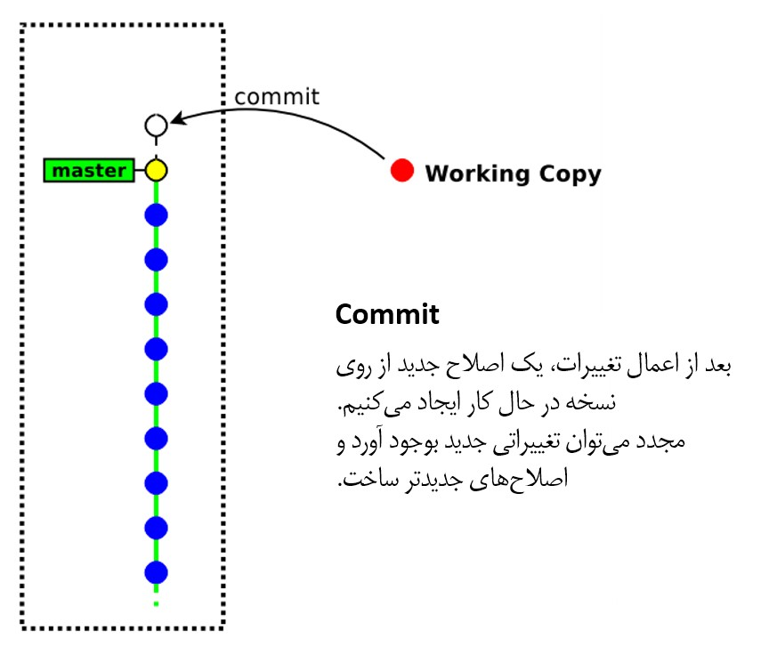
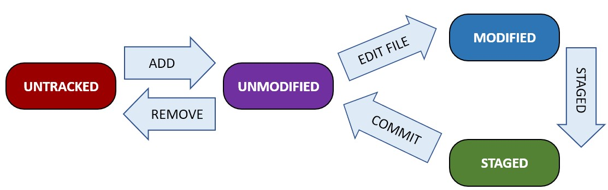

# سامانه‌ کنترل نسخه (VCS)

سامانه کنترل نسخه (Version Control System) یا به اختصار VCS، یکی از مهم‌ترین سیستم‌های مورد استفاده در دنیای برنامه‌نویسان امروز است. با مثالی ساده، یکی از ویژگی های مهم این سیستم را بررسی می‌کنیم؛ فرض کنید یک فایل متنی را ایجاد و چندین بار آن را ویرایش کرده‌اید. در ویرایش پنجم به این نتیجه می‌رسید که ویرایش اول شما بهتر بوده و قصد بازگشت به نسخه‌ای را دارید که در ویرایش اول ایجاد شده‌ است. VCS این امکان را به شما می‌دهد که بی‌نهایت بار اشتباه کنید و بتوانید اشتباهات خود را جبران کنید. به وسیلهٔ VCS، می‌توانید نسخه‌های متفاوتی از فایل‌های پروژه را نگهداری کرد و در صورت وقوع اشتباه، آن را تصحیح کرد. البته این یکی از چندین کاربرد‌ VCS است.

VCS تغییرات و ویرایش‌های ما را ذخیره‌سازی کرده و به هنگام خطا و در صورت نیاز می‌توانند نسخه های قبلی را بازیابی کنند. همچنین VCS با فراهم کردن امکانات مهمی همچون قابلیت پیگیری تغییرات اعمالی و جلوگیری از تداخل آنها با یکدیگر و ساخت شاخه‌های مختلف از پروژه، فرآیند توسعه پروژه‌ها به صورت گروهی را ساده‌تر می‌سازند. اساس کارکرد VCS، بر روی ثبت و ذخیره‌سازی تاریخچهٔ تغییرات فایل‌ها است. 

برخی از ویژگی‌های مهم این سیستم‌ها عبارتند از:

1. قابلیت بازگشت به نسخه‌های مختلف از محتویات فایل‌ها
2. مدیریت تداخل تغییرات اعمال شده توسط اعضاء پروژه
3. کاهش ریسک از دست رفتن فایل در اثر اشتباه
4. مقایسه نسخه‌های مختلف یک فایل و بررسی تغییرات
5. پشتیبان‌گیری از انواع فایل‌ها نظیر کدهای یک برنامه کامپیوتری و یا فایل های صوتی و تصویری


## انواع VCS 

VCS ها به سه دستهٔ **محلی**، **متمرکز** و **توزیع‌شده** تقسیم می‌شوند. در ادامه هر کدام از دسته‌ها بررسی خواهدشد.


*تصویر ۱ - انواع سامانه‌های کنترل نسخه*


### VCS محلی 

ساده‌ترین کاری که یک کاربر می‌تواند برای کنترل نسخ پروژه خود انجام‌ دهد، کپی کردن فایل‌ها داخل یک پوشه جدا (و اگر هوشمندانه باشد، با ثبت ساعت و تاریخ آن لحظه به عنوان نام آن پوشه) بعد از هر تغییر مهم است. علی‌رغم راحتی و سادگی، اینکار شدیدا مستعد بوجود آوردن خطا است؛ زیرا کاربر به سادگی می‌تواند مبدا و مقصد عملیات کپی را اشتباه کند و همه چیز خراب شود! یا حتی تغییرات به اشتباه در فایل‌های قدیمی‌تری انجام اعمال شود و باعث حذف ناخواسته یک سری تغییرات دیگر شود!

برای حل چالش کنترل نسخه، برنامه‌نویسان از مدت‌ها پیش سیستم‌های مدیریت نسخه‌ای را توسعه دادند که از یک پایگاه داده ساده برای ثبت تغییرات در فایل‌ها بهره می‌بردند. 


*تصویر ۲ - شمای سامانه کنترل نسخه محلی*


یکی از معروف‌ترین ابزارهای VCS به نام RCS (Revision Control System) است که همچنان بر روی بسیاری از کامپیوترها (عمدتا لینوکسی) یافت می‌شود. RCS با نگهداری مجموعه‌ای از وصله‌ها (Patch؛ تغییرات بین دو نسخه متوالی از فایل) در قالب یک فرمت مشخص بر روی دیسک کار می‌کند. پایگاه داده RCS **تنها** در اختیار کاربر محلی کامپیوتر قرار دارد؛ بنابراین افراد بیرون از ناحیهٔ محلی، توانایی تعامل با پایگاه داده مربوطه را ندارند.

از نقاط ضعف این مدل از VCS ها می‌توان به **عدم امکان مدیریت پروژه‌های گروهی** و همچنین **نقطه تکی شکست** اشاره کرد.

<div class="meta notice">
<p>
نقطه تکی شکست
(Single point of failure)
زمانی مطرح می‌شود که منابع مورد استفاده در یک نقطه فیزیکی (مثلا یک سرور) تجمیع شده و در صورتی بوجود آمدن خرابی در آن نقطه، منابع با خطر خرابی یا از بین رفتن مواجه شوند.
</p>
</div>


### VCS متمرکز 

برای رفع نیاز همکاری با سایر اعضاء پروژه، VCS های متمرکز ارائه شدند. این سامانه‌ها از یک سرور که حاوی تمام نسخه‌های فایل‌ها هستند، استفاده می‌کند. هر یک از کاربران که بر روی یک پروژهٔ مشترک فعالیت می‌کنند، می‌توانند مستقلا با سرور در ارتباط باشند (به صورت ارتباط Client/Server)، تغییرات جدید را دریافت و یا تغییرات خودشان را در آن ثبت کنند. برای مثال، در تصویر زیر می‌بینیم که کاربر A و کاربر B به صورت مستقل به سرور VCS مرکزی متصل هستند و عملیات مورد نیاز خود را انجام می‌دهند. برای سال‌های متمادی، نوع متمرکز به عنوان نوع استاندارد VCSها شناخته می‌شد.


*تصویر ۳ - شمای سامانه کنترل نسخه متمرکز*


با این حال، VCSهای متمرکز نیز از ایراد مبرا نیستند. واضح‌ترین عیب آنها، بوجود آمدن یک نقطه شکست به واسطه متمرکز بودن معماری آنها است؛ یعنی اگر سرور برای چند ساعت در دسترس نباشد (مثلا با هدف تعمیرات، بروزرسانی یا حتی به دلیل خرابی سرور) هیچ کاربری نمی‌تواند نسخه‌ جدید از فایل‌هایش را ذخیره کند. یا حتی بدتر از آن، اگر دیسک سخت سرور خراب شود، تقریبا همه چیز از بین می‌رود!

در این نوع VCS‌ها، تمام داده‌ها بر روی **تنها** یک سرور مرکزی ذخیره می‌شوند. یعنی اگر اعضاء بخواهند تغییراتی در پروژه ایجاد کنند،برای ثبت تغییرات حتما باید به سرور مرکزی متصل باشند.

به طور خلاصه، ویژگی‌های VCS متمرکز عبارتند از:

1. دسترسی چندین کاربر به یک منبع واحد 
2. امکان مدیریت متمرکز بر روی مجوزهای دسترسی 

همچنین، برخی از نمونه‌های VCS متمرکز نیز عبارتند از: 

1. CVS 
2. Perforce 
3. Subversion 


### VCS توزیع‌شده

در یک VCS توزیع‌شده، کاربران نه تنها آخرین تغییرات اعمال‌شده بر فایل‌ها را از سرور دریافت می‌کنند، بلکه یک نسخه کامل از مخزن (=محلی که مجموعه فایل‌های حاوی نسخه‌های مختلف از یک پروژه در آن قرار داد) به همراه سوابق تغییرات پروژه را نیز در سمت خود می‌سازند. بنابراین، در صورت وقوع خرابی در سرور، هر کدام از مخازن ساخته شده سمت کاربران می‌تواند به عنوان پشتیبان در نظر گرفته شده و بازیابی اطلاعات در سرور از طریق آن انجام شود (حتی هر کاربر خودش می‌تواند در نقش سرور برای باقی کاربران عمل کند). به عبارت دیگر، هر کاربری که از VCS توزیع‌شده استفاده می‌کند، یک نسخه پشتیبان کامل از تمام داده‌ها را در اختیار دارد. همچنین در صورتی که سرور اصلی در دسترس نباشد، اعضای گروه می‌توانند تغییرات را در سیستم خودشان اعمال کرده و در زمانی که ارتباط دوباره برقرار شد آن را با سرور اصلی هنگام‌سازی کنند. در تصویر زیر مشاهده می‌شود که کاربران A و B هر کدام یک نسخه کامل از سرور را در سمت خودشان دارند و در صورت از دست رفتن ارتباط با سرور، می‌توانند با یکدیگر نیز ارتباط برقرار کنند.


*تصویر ۳ - شمای سامانه کنترل نسخه توزیع‌شده*


به علاوه، بسیاری از VCS های توزیع‌شده، قابلیت پشتیبانی از چندین مخزن از راه دور را دارند. به این صورت که کاربر می‌تواند بر روی توسعه یک پروژهٔ واحد با تیم‌های مختلفی که آدرس مخزن سرورشان با یکدیگر متفاوت است، همکاری کند.


نمونه‌های VCS توزیع‌شده عبارتند از:

1. GIT (مهمترین و پرکاربردترین)
2. Bazaar
3. Mercurial
4. Darcs 

در تصویر زیر میتوان تاریخچهٔ ظهور VCS های توزیع‌شده را مشاهده نمود.


*تصویر ۴ - خط زمانی ظهور VCSهای توزیع‌شده*


## گیت GIT 

همانطور که گفته شد، گیت یک سیستم کنترل نسخه است که به صورت توزیع‌شده سازماندهی می‌شود. گیت تنها سیستم کنترل نسخه موجود نیست، اما معروف‌ترین آنهاست.


*تصویر ۵ - درختوارهٔ تاریخچه توسعه لینوکس*


توسعهٔ گیت از زمانی آغاز شد که جامعه توسعه‌دهندگان لینوکس، استفاده از بیت کیپر (یک سامانه مدیریت کد که قبلاً برای توسعه هستهٔ لینوکس استفاده می‌شد) را به دلایل مسائل حقوقی کنار گذاشتند. لذا، تصمیم بر آن شد که سامانه مدیریت نسخه‌ای توسعه داده شود که هم جایگزین بیت‌کیپر شود، هم مشکلات موجود در آن و نیازمندی‌های جدید را رفع نماید. در نهایت، اولین نسخه از گیت در دسامبر ۲۰۰۵ به صورت رسمی عرضه شد.

<div class="meta info">
<p>
برای مطالعه بیشتر درباره رابطه با ارتباط لینوکس و بیت‌کیپر می‌توانید از
<a href="https://lwn.net/Articles/130746/">اینجا</a>
اطلاعات بیشتری کسب کنید.
</p>
</div>

اهداف مهمی که در توسعه گیت در نظر گرفته شدند عبارتند از:

1. **سرعت**
2. **طراحی ساده**
3. **پشتیبانی از توسعه غیر خطی**: یعنی چندین شاخه از یک پروژه را بتوان به صورت موازی پیش برد.
4. **توزیع شدگی کامل**
5. **توانایی مدیریت پروژه های بزرگ** (‌مانند کرنل سیستم عامل لینوکس)

گیت برای هماهنگ کردن وظایف میان اشخاص مختلفی که روی یک پروژه کار می‌کنند، بسیار مفید است. می‌توانید از گیت برای نوشتن یک مقاله استفاده کنید، یا وقتی که می‌خواهید تغییراتِ اعمال شده را، در یک فایل هنری یا طراحی، پیگیری کنید. بسیاری از برنامه‌نویسان به صورت روزانه از گیت استفاده می‌کنند و تسلط روی آن می‌تواند تأثیر خوبی روی رزومه‌ی کاری‌تان داشته باشد.

## نگهداری داده‌ها در گیت

مهمترین تفاوت بین GIT و سایر VCSها (مانند SVN)، دیدگاه آن نسبت به ذخیره‌سازی داده‌ها است شده است. در اکثر VCSها، اطلاعات به شکل لیستی از تغییرات **فایل-محور** ذخیره می‌شود. در واقع، این ابزارها به اطلاعات به چشم مجموعه‌ای از فایل‌ها و تغییراتی نگاه می‌کنند که در گذر زمان در فایل‌های اولیه اتفاق می‌افتند. به این روش کنترل نسخه اصطلاحا **تغییر-محور** گفته می‌شود.

تصویر زیر یک سناریوی ساده از مدل ذخیره‌سازی تغییر-محور را نشان می‌دهد؛ در نسخهٔ شماره ۱، سه فایل A، B و C وجود در پروژه وجود دارند. بعد از مدتی، A و C دچار تغییر شده و و این تغییرات در نسخهٔ شماره ۲ ذخیره می‌شوند. از آنجایی که B از نسخه قبل تا نسخه جدید تغییری نداشته است، اطلاعات جدیدی هم از آن در نسخه ۲ اضافه نمی‌شود. به همین منوال، عملیات ثبت نسخ جدید در آینده نیز ادامه پیدا می‌کند.


*تصویر ۶ - ذخیره‌سازی اطلاعات به شکل تغییرات نسبت به نسخه پایه هر فایل*


در گیت، به اطلاعات به چشم جریانی از لحظه‌نگارهای (Snapshot) یک فایل‌سیستم مینیاتوری نگاه می‌شود. هر زمان که آماده ایجاد نسخه جدید می‌شوید و حالت فعلی پروژه خود را ذخیره می‌کنید، GIT در آن لحظه یک تصویر (=لحظه‌نگار) از تمام فایل‌های شما ثبت کرده و اشاره‌گری به آن را ذخیره می‌کند. برای کارایی بیشتر، فایل‌هایی که تغییری نداشته‌اند، در لحظه‌نگار جدید ثبت نمی‌شوند و تنها ارجاعاتی به آنها (در آخرین نسخه تغییر یافته) نگهداری می‌شود.

در تصویر زیر، می‌توانیم سناریوی مبتنی بر مدل ذخیره‌سازی اطلاعات در گیت را مشاهده کنیم؛ در نسخه ۱، تمام فایل‌های پروژه ثبت می‌شوند. در نسخه ۲، تنها فایل‌های A و C تغییر یافته است؛ لذا در لحظه‌نگار مربوط به نسخه ۲، کل فایل‌های A و C و لینک به فایل‌ B در نسخه ۱، در نظر گرفته خواهند شد. در نسخه ۳، تنها فایل C تغییر یافته است؛ لذا کل فایل C به همراه لینک‌های فایل B در نسخه ۱ و فایل B در نسخه ۲ در لحظه‌نگار مربوطه ذخیره خواهند شد.


*تصویر ۷ - ذخیره‌سازی اطلاعات به شکل جریانی از لحظه‌نگارها در طول انجام پروژه*


## نصب گیت

ابزار گیت (تقریبا) در هر سیستم عاملی قابل نصب است. در ادامه، راهنمای نصب مربوط به دو سیستم عامل ویندوز و توزیع‌ لینوکسی Ubuntu آورده شده است.


### طریقه نصب در ویندوز 

برای نصب گیت در سیستم عامل ویندوز، از طریق سایت رسمی [گیت](https://git-scm.com/download/win) نسخه مربوط به سیستم عامل خود را دانلود و به شکل زیر آن را نصب کنید. 

 


*تصویر ۸ - مراحل نصب گیت در سیستم عامل ویندوز*


پس از اتمام مراحل نصب، Git Bash نیز به صورت خودکار نصب می‌شود. با استفاده از Git Bash می‌توان دستورات مهم لینوکسی را در محیط سیستم عامل ویندوز اجرا کرد (تصویر زیر):

<p align="center">
  
</p>


*تصویر ۹ - بررسی نسخه گیت نصب‌شده*


### طریقه نصب در Ubuntu

در سیستم عامل لینوکس و در نسخه ی Ubuntu با استفاده از دستور زیر می‌توان گیت را نصب کرد :‌

```bash
sudo apt-get update 
sudo apt-get install git 
```

در سایر توزیع‌های لینوکسی نیز می‌توان اقدام به نصب گیت کرد. برای مثال، در نسخه‌های redhat می‌توان با اجرای دستور زیر، گیت را نصب کرد:

```bash
sudo yum install git 
```


## اصطلاحات مهم
قبل از آغاز کار با گیت و بررسی امکانات آن به صورت عملی، می‌بایست با اصطلاحات حیاتی و مهم آن آشنایی پیدا کنیم. تعدادی از مهمترین این اصطلاحات در ادامه آورده شده است.


### مخزن یا Repository 

مخزن در بردارندهٔ سابقهٔ کلی پروژهٔ شماست. تمام تغییرات شما بر روی فایل‌های پروژه، در مخزن قابل مشاهده است.

<p align="center">
  
</p>


*تصویر ۱۰ - مخزن*


دو نوع مخزن داریم:

1. **محلی**: این نوع مخزن روی ماشین و کامپیوتر شما ذخیره می‌شود و می‌توان به صورت مستقیم به آن دسترسی داشت. 
2. **از راه دور** (ریموت): این نوع از مخزن‌ها در واقع یک سرور هستند که افراد مختلف می‌توانند به آن متصل شده و تغییرات را دریافت کنند.


### اصلاح Revision

در گیت تغییرات نسبت به نسخه‌های قبلی ذخیره می‌شود و هر تغییر تحت عنوان یک اصلاح یا Revision ذخیره می‌شود. Revision ها یک نویسندهٔ مشخص دارند و علاوه بر این حاوی پیامی است که توضیحات مربوط به تغییرات این نسخه است که توسط نویسنده بیان شده است.

<p align="center">
  
</p>


*تصویر ۱۱ - اصلاح*


### برچسب Tag

پس از چندین اصلاح ممکن است به یک اصلاح خاص برسیم (مثلا یک نسخه از پروژه تولید شود که بخواهیم آن را به شکلی متمایز کنیم) که می‌توان آن را به وسیله یک برچسب علامت‌گذاری کرد.


*تصویر ۱۲ - برچسب*


### شاخه Branch

برای فهم بهتر مفهوم شاخه، سناریوی زیر را در نظر بگیرید؛ فرض کنید شما و دوست برنامه‌نویس‌تان قصد دارید روی یک پروژه کار کنید و قسمت‌های مختلف را بین خود تقسیم می‌کنید. برای این که شما دو نفر به صورت موازی بتوانید وظایف مشخص خود را پیش ببرید هر کدام یک شاخه ایجاد کرده و تغییرات را روی شاخهٔ مربوط به خودتان انجام می‌دهید. استفاده از شاخه در گیت خصوصا در پروژه‌هایی که به **صورت گروهی** انجام می‌گیرد، بسیار ضروریست.

برای مثال در تصویر پایین، دو شاخه وجود دارد؛ یکی شاخهٔ اصلی و دیگری شاخه‌ای که از اصلاح `v1.0` از شاخهٔ اصلی انشعاب گرفته شده است.


*تصویر ۱۳ - شاخه*


### ایجاد تغییر در پروژه و اعمال آن 

فرض کنید در یک پروژه (که تحت گیت مدیریت می‌شود) وظایفی به شما در مورد توسعه پروژه محول شده است. ابتدا باید یک کپی از آخرین نسخهٔ پروژه را از سرور دریافت کنید (در این سناریو فرض کرده‌ایم که آخرین نسخه از شاخهٔ `master` دریافت شده است).


*تصویر ۱۴ - شمای شاخه اصلی*

به عمل دریافت آخرین نسخه پروژه از سرور، Checkout گفته می‌شود که در نتیجه آن، شما یک نسخه (Working Copy) از پروژه را در پوشهٔ مد نظر خود (Working tree یا Working Directory) ایجاد می‌کنید:


*تصویر ۱۵ - دریافت آخرین نسخه پروژه*

بعد از دریافت پروژه، می‌توانیم شروع به توسعه و اعمال تغییرات در پروژه کنیم:


*تصویر ۱۶ - اعمال تغییرات بر روی فایل‌های پروژه*

پس از اعمال تغییرات، می‌بایست آنها را به شکل یک اصلاح جدید در مخزن ذخیره کنیم. به این کار ثبت یا اصطلاحا کامیت (Commit) گفته می‌شود:



*تصویر ۱۷ - اعمال تغییرات روی مخزن و ثبت آنها*


از دیدگاه گیت، فایل‌های پروژه (موجود در Working Directory) می‌توانند یکی از ۴ حالات زیر را داشته باشند:

- **Untracked**: داخل Working Directory هستند ولی تغییرات‌شان توسط گیت رصد نمی‌شوند.
- **Unmodified**: توسط گیت رصد می‌شوند و از کامیت قبلی تاکنون تغییری نداشته‌اند.
- **Modified**: توسط گیت رصد می‌شوند، ولی برای ثبت در کامیت بعدی انتخاب نشده‌اند.
- **Staged**: آمادهٔ ثبت در کامیت بعدی هستند.



*تصویر ۱۸ - حالات مربوط به فایل‌های پروژه*


به ناحیه‌ای که فایل‌های دارای حالت Staged در آن قرار دارند، اصطلاحا Staging Area یا Index Area نیز گفته می‌شود.


## ساخت مخزن
با استفاده از دستور زیر می‌توان یک مخزن جدید ساخت:

```bash
git init [repo-name]
```

اگر با ترمینال (یا command line ویندوز) کار می‌کنید، ابتدا باید اطمینان حاصل کنید که در مسیر درستی برای ساخت مخزن قرار دارید. برای اینکار از دستور `pwd` (در ترمینال لینوکس) یا دستور `dir` در command line ویندوز استفاده می‌کنیم:

```bash
cw@testing:~$ pwd
/home/cw/
```

دستور `pwd` (که یک دستور لینوکسی است) به ما اعلام می‌کند که مسیر فعلی چیست (با این دستور در مبحث لینوکس بیشتر آشنا می‌شویم). خروجی دستور بالا در یک ماشین لینوکسی معنا پیدا می‌کند. در یک ماشین ویندوزی (و با استفاده از Git Bash)، خروجی به این شکل خواهد بود:

```bash
cw@testing: MINGW64 ~
$ pwd
/c/Users/cw
```

در ادامه مثال، یک مخزن گیت درون پوشه‌ای با نام `project` می‌سازیم: 

```bash
cw$testing:~$ git init project
Initialized empty Git repository in /home/cw/project/.git/
```

سپس بررسی می‌کنیم که در پوشه `project` که ساخته شده چه چیزهایی وجود دارد:

```bash
cw@testing:~$ ls -a project
.  ..  .git
```

سه پوشه در پوشه `project` وجود دارد؛ `.`، `..` و `.git`. با دو پوشهٔ اول در مبحث لینوکس آشنا خواهید شد. همینقدر بدانید که پوشهٔ `.git` محلی است که مخزن پروژه `project` در آن قرار دارد.

می‌توانید محتویات پوشهٔ مخزن را نیز ببینید (در این درس از بررسی آنها چشم‌پوشی می‌کنیم):

```bash
cw@testing:~$ ls -a project/.git
branches  config  description  HEAD  hooks  info  objects  refs
```

در صورتی که ورودی دستور `git init` خالی باشد، مخزن در پوشه ی فعلی (که در آن قرار داریم) ذخیره می‌شود. به عبارتی، در مثال قبل می‌توانستیم ابتدا پوشه `project` را ایجاد کنیم و سپس یک مخزن درون آن ایجاد کنیم.

<div class="meta warning">
<p>
پوشهٔ 
<code>.git</code>
حاوی کلیهٔ اطلاعات مهم پروژه توسط گیت است و نباید هیچ وقت آن را حذف کنید . در صورت حذف آن، کلیهٔ سوابق پروژه و تغییرات آن از بین می‌رود.
</p>
</div>


## ثبت مشخصات کاربر 

پس از نصب گیت و قبل از هر کاری، می‌بایست اطلاعات خود را که شامل یک ایمیل و یک نام کاربری است در تنظیمات مخزن ثبت کنید: 

```bash
git config --global user.email "your-email"
git config --global user.name "your-username"
```

با اینکار، شما به صورت سراسری ایمیل و نام کاربری‌تان را برای هر پروژه‌ای که تحت گیت باشد، تنظیم می‌کنید. اگر مایل به تنظیم سراسری این موارد نیستید یا می‌خواهید این تنظیمات را برای هر پروژه‌ به صورت مجزا انتخاب کنید، دستور بالا را بدون سوییچ `--global` و در پوشهٔ پروژه مورد نظر، اجرا کنید. برای مثال، دستورات بالا را به این شکل وارد می‌کنیم:

```bash
cw@testing:~/project$ git config user.email "testing@cw.com"
cw@testing:~/project$ git config user.name "tester"
```

<div class="meta notice">
<p>
ایمیل و نام کاربری‌ای که در تنظیمات گیت وارد می‌کنید، می‌تواند هر چیزی باشد (حتی اطلاعات جعلی). با این حال،
با توجه به اینکه این اطلاعات توسط سایر اعضاء پروژه قابل مشاهده است،
توصیه می‌شود انتخاب‌تان به گونه‌ای باشد که برای سایر کاربران پروژه قابل شناسایی باشید.
</p>
</div>


## ایجاد و ثبت تغییرات 

پس از مقداردهی اولیهٔ مخزن، در پوشهٔ پروژه تغییرات خود را اعمال کنید. برای افزودن فایل(ها) به Staging Area از دستور زیر استفاده می‌کنیم:

```bash
git add file [file1] [file2] ... 
```

برای مثال، فایل `hello` را می‌سازیم و به پروژه اضافه می‌کنیم:

```bash
cw@testing:~/project$ echo 'Hello World!' > hello
cw@testing:~/project$ git add hello
```

در خط اول، دستور پایین فایل `hello` شامل محتوای متنی `Hello World` ایجاد شده‌ است (با دستور echo در مبحث آموزش لینوکس بیشتر آشنا می‌شوید). برای ثبت حالت فعلی پروژه (ایجاد لحظه‌نگار جدید)، از دستور زیر استفاده می‌کنیم:

```bash
git commit -m [message]
```

در ادامه مثال قبلی، ثبت کامیت را به صورت زیر انجام می‌دهیم:

```bash
cw@testing:~/project$ git commit -m "added file 'hello'"
[master (root-commit) 28de2e5] added file 'hello'
 1 file changed, 1 insertion(+)
 create mode 100644 hello
```

میتوان به جای اضافه کردن تک به تک فایل‌ها، از کاراکتر نقطه `.` استفاده کنیم. با اینکار، تمامی فایل‌هایی که یا در مسیر فعلی قرار دارند، یا محل قرارگیری آنها جزو زیرمجموعه‌های مسیر فعلی است، به Staging Area اضافه می‌شوند:

```bash
git add . 
```

برای هر کامیت **باید** یک پیام وارد شود. این پیام شامل یک عبارت توضیحی در مورد تغییراتی است که در فایل ها ایجاد شده است.

<div class="meta notice">
<p>
همواره سعی کنید تا پیام کامیت را به گونه‌ای انتخاب کنید که ضمن کوتاه و مختصر بودن، معرف تغییراتی باشد که این پیام را روی آن قرار می دهید.
</p>
</div>


## گزارش تغییرات

با استفاده از دستور زیر می‌توان اطلاعات کلی کامیت‌هایی که اخیرا در پروژه اعمال شده است را مشاهده کنیم:

```bash
git log 
```

اجرای این دستور منجر به این خروجی خواهد شد:

```bash
cw@testing:~/project$ git log
commit 28de2e5cf7fc12a499484165b71fbbe8940799bc (HEAD -> master)
Author: tester <tester@cw.com>
Date: Mon Sep 27 18:44:01 2021 +0330
	
	added file `hello`
```

<div class="meta notice">
<p>
هر کامیت، مقدار منحصر به فردی دارد که با عنوان
Commit Hash
یا هشِ کامیت شناخته می‌شود. در خروجی دستور
<code>git log</code>
مقدار نوشته شده روبروی عبارت
<code>commit</code>
همان هش کامیت است. هر زمان که استفاده از هش کامیت نیاز شد، می‌توانید تنها ۷ کاراکتر اول آن را بنویسید.
</p>
</div>


## گزارش وضعیت 

با استفاده از دستور زیر می‌توان اطلاعات زیادی را در مورد مخزن دریافت کرد.

```bash
git status
```

اطلاعات قابل نمایش توسط این دستور عبارتند از:

- شاخه کنونی 
- وضعیت تازگی اطلاعات نسبت به سرور 
- فایل‌های تغییر یافته (Modified)  ولی نشان نشده (‌Unstaged)
- فایل‌های تغییر یافته و آمادهٔ ثبت (Staged)
- فایل‌های جدیدا اضافه شده و آماده ثبت (Staged)
- فایل‌های موجود ولی خارج از رصد (Untracked)

پس از اجرای دستور بالا خروجی زیر ظاهر می‌شود:

```bash
cw@testing:~/project$ git status
On branch master
nothing to commit, working tree clean
```

طبیعی است که چیزی برای کامیت شدن وجود نداشته باشد (چون تغییر جدیدی رخ نداده است). حال یک فایل جدید ایجاد می‌کنیم تا وضعیت را مجددا بسنجیم:

```bash
cw@testing:~/project$ echo "Hello Universe!" > universe
cw@testing:~/proejct$ git status
On branch master
Untracked files:
  (use "git add <file>..." to include in what will be commited)
        universe


nothing added to commit but untracked files present (use "git add" to track)
```

با دستورات بالا، فایل `universe` را ایجاد و دستور `git status` را مجددا اجرا کردیم. همانطور که مشاهده می‌شود، فایل تازه ایجاد شدهٔ `universe` توسط گیت شناسایی شده است، ولی هنوز تغییرات آن رصد قابل رصد نیست. برای بردن فایل به حالت Staged از دستور `git add` استفاده کرده و سپس وضعیت را دوباره می‌سنجیم:

```bash
cw@testing:~/project$ git add universe
cw@testing:~/project$ git status
On branch master
Changes to be committed:
  (use "git restore --staged <file>..." to unstage)
        new file:   universe
```

مشاهده می‌شود که پس از اضافه شدن، وضعیت فایل `universe` تغییر کرد و به حالت Staged تغییر یافت. حال محتویات فایل `hello` (که قبلا ساخته شده است) را تغییر می‌دهیم و وضعیت را دوباره بررسی می‌کنیم:

```bash
cw@testing:~/project$ echo "Hello again" >> hello
cw@testing:~/project$ git status
On branch master
Changes to be committed:
  (use "git restore --staged <file>..." to unstage)
        new file:   universe

Changes not staged for commit:
  (use "git add <file>..." to update what will be committed)
  (use "git restore <file>..." to discard changes in working directory)
        modified:    hello
```

همانطور که مشاهده می‌شود فایل `hello` آماده ی کامیت شدن نیست (در حالت Modified قرار دارد). برای تغییر حالت فایل‌های Modified به Staged، می‌بایست از سوییچ `-a` در دستور کامیت استفاده کرد:

```bash
cw@testing:~/project$ git commit -am "added file 'universe'"
[master 524757a] added file 'universe'
 2 files changed, 2 insertions(+)
 create mode 100644 universe
cw@testing:~/project$ git status
On branch master
nothing to commit, working tree clean
cw@testing:~/project$ git log
commit 523757a046e5f44aeed6131e516ffb37e694dcfa
Author: tester <tester@cw.com>
Date: Mon Sep 27 20:03:41 2021 +0330

    added file 'universe'

commit 28de2e5cf7fc12a499484165b71fbbe8940799bc
Author: tester <tester@cw.com>
Date: Mon Sep 27 18:44:01 2021 +0330
    
    added file 'hello'
```

<div class="meta notice">
<p>
وقتی از دو سوییچ به صورت همزمان در دستور استفاده می‌کنیم (اینجا یعنی سوییچ‌های
<code>-a</code> و
<code>-m</code>
)
می‌توان آنها را چسبیده بهم نوشت. در این صورت، تنها یک کاراکتر
<code>-</code>
نوشته می‌شود.
</p>
</div>

در صورتی که از سوییچ ‍`-a` استفاده نکنیم، فایل `hello` همچنان در حالت Modified خواهد ماند:

```bash
cw@testing:~/project$ git commit -m "added file 'universe'"
[master 771d323] added file 'universe'
 1 file changed, 1 inserstion(+)
 create mode 100644 universe
cw@testing:~/project$ git status
On branch master
Changes not staged for commit:
  (use "git add <file>..." to update what will be committed)
  (use "git restore <file>..." to discard changes in working directory)
        modified:   hello

no changes added to commit (use "git add" and/or "git commit -a")
```

یک راه دیگر آن است که پس از تغییر فایل `hello` مجددا آن را با دستور `git add` به حالت Staged ببریم:

```bash
git add hello
```


## ساخت شاخه

هنگامی که به تازگی یک مخزن ایجاد می‌کنیم، به صورت پیش‌فرض یک شاخهٔ `master` ساخته می‌شود که نقش شاخه اصلی مخزن مذکور را بازی می‌کند و هر کامیتی که انجام دهیم روی این شاخه انجام می‌شود. با استفاده از این مفهوم، می‌توان به تعداد توسعه‌دهندگانی که در تیم حضور دارند شاخه‌های اختصاصی ساخته و در آن واحد تمامی اعضای تیم بتوانند اقدام به پیشبرد پروژه کنند و هر زمان که لازم شد، شاخه‌ها را با یکدیگر ادغام کنند.

<div class="meta info">
<p>
در توسعه ی پروژه، فقط باید کدهایی روی شاخهٔ اصلی قرار گیرد که کاملا پایدار و بدون مشکل هستند. با این تفاسیر منطقی به نظر میرسد که شاخهٔ <code>master</code> به عنوان شاخهٔ آزمون و خطا استفاده نشود و هنگامی که یکی از اعضای تیم قصد توسعهٔ نرم افزار را داشت شاخهٔ جدایی را ایجاد کرده و روی آن ادامه دهد تا هنگامی که به پایداری اشاره شده برسد.
</p>
</div>


<p align="center">
  
</p>

 *تصویر ۱۹ - شاخه اصلی پروژه به همراه دو شاخه فرعی*


همان‌طور که در تصویر فوق ملاحظه می‌شود، خط افقی که در سراسر نمودار مشاهده می‌شود به عنوان شاخه اصلی یا `master` است. فرض می‌کنیم توسط توسعه‌دهندهٔ اصلی پروژه، کامیت‌هایی تحت عناوین `C1‍` و `C2` انجام شده است. سپس یک شاخه از شاخهٔ اصلی جدا شده و نامی دلخواه همچون `Branch1` برای آن در نظر گرفته‌ایم (که فرضاً توسط یکی از اعضای تیم توسعه داده می‌شود) به طوری که وی سه کامیت داخل این شاخه انجام داده است. به صورت موازی،‌ برای یکی دیگر از اعضای تیم شاخه‌ای به نام `Branch2` ساخته شده و او نیز یک کامیت در این شاخه انجام داده است. در نهایت، دولوپر اصلی این پروژه کلیهٔ تغییرات اِعمال‌ شده در دو شاخهٔ فوق را با شاخهٔ اصلی ادغام کرده و مجموع این تغییرات را تحت عنوان `C7` در شاخه اصلی کامیت کرده است.

در مثال خودمان، برای آنکه لیستی از شاخه‌های پروژه را مشاهده کنیم دستور زیر را اجرا می‌کنیم:‌

```bash
cw@testing:~/project$ git branch
* master
```

این دستور لیستی از کلیه ی شاخه‌ها را نمایش می‌دهد و همانطور که گفته شد، شاخهٔ `master` به صورت شاخهٔ انتخابی پیش‌فرض نمایش داده شده‌ است. علامت `*` تایید می‌کند که در حال حاضر، روی این شاخه هستیم.

فرض کنید که می‌خواهیم شاخهٔ دیگری از شاخهٔ اصلی انشعاب بگیریم تا وظایف خود را روی آن شاخه ادامه دهیم. به شکل زیر عمل کرده و شاخه ی `Branch1` را ایجاد می‌کنیم:

```bash
cw@testing:~/project$ git branch Branch1
```

پس از ایجاد شاخهٔ مورد نظر، یک بار دیگر لیست شاخه‌ها را نمایش می‌دهیم:

```bash
cw@testing:~/project$ git branch
* master
  Branch1
```


## جابجایی میان شاخه‌ها و کامیت‌ها

برای رفتن به شاخه‌ای غیر از شاخه فعلی از دستور زیر استفاده می‌کنیم:

```bash
git checkout <branch-name>
```

در مثال قبل، برای رفتن به شاخه `Branch1` به این صورت عمل می‌کنیم:

```bash
cw@testing:~/project$ git checkout Branch1 
Switched to branch 'Branch1'
```

با بررسی مجدد لیست شاخه‌ها و دیدن علامت `*` روبروی نام `Branch1`، متوجه می‌شویم که جابجایی تایید شده است:

```bash
cw@testing:~/project$ git branch
  master
* Branch1
```

از دستور `git checkout` همچنین برای ایجاد یک شاخه و پریدن روی آن در قالب یک دستور واحد نیز استفاده می‌شود:

```bash
git checkout -b <branch-name>
```

در واقع دستور بالا، خلاصه دو دستور پایین است:

```bash
git branch <branch-name>
git checkout <branch-name>
```

برای آنکه در عمل هم متوجه این موضوع شویم، در ادامه مثال قبل یک فایل متنی ایجاد می‌کنیم؛ سپس آن را کامیت می‌کنیم تا ببینیم تغییرات در کدام شاخه اعمال می‌شود:

```bash
cw@testing:~/project$ git add new.txt
cw@testing:~/project$ git commit -m "new file added"
[branch1 b276cac] new file added
 1 file changed, 3 insertions(+)
 create mode 100644 new.txt
```

سپس گزارش تغییرات شاخه را با دستور `git log` چک می‌کنیم:

```bash
cw@testing:~/project$ git log --oneline
b276cac (HEAD -> Branch1) new file added
...
```

همانطور که در پیامی که برای کامیت آمده است می‌بینیم، تغییرات روی شاخه `Branch1` اعمال شده است (و نه شاخهٔ `master`). سوییچ `--oneline` برای این استفاده شده‌ است که تنها موارد کلی مثل پیام کامیت و ۷ کاراکتر اول هش کامیت نمایش داده‌ شود و از نمایش جزئیات غیر ضروری دیگر خودداری شود.

با جابجایی میان شاخه‌ها، به صورت پیش‌فرض به آخرین کامیت شاخه مقصد می‌رویم. تصویر زیر بیانگر این موضوع است:

<p align="center">
  
</p>


از آنجایی که جابجایی بین کامیت‌های دو شاخه انجام می‌شود، بر اساس اختلافات میان این دو کامیت، ممکن است پس از اجرای دستور فایل‌ها و محتوای آنها تغییراتی داشته باشد. با برگشت به شاخه (و کامیت) قبلی، فایل‌ها و محتوایشان به حالت سابق باز خواهند گشت. برای فهم بهتر این موضوع، به شاخهٔ `master` رجوع کنید تا وضعیت فایل `new.txt` در این شاخه را بررسی کنید: 

```bash
cw@testing:~/project$ git checkout master 
Switched to branch 'master'
```

اکنون اگر به محتویات داخل پوشه نگاهی بیندازید،‌ خواهید دید که فایل `new.txt` حذف شده است.

همانطور که بالاتر گفته شد، با جابجایی میان شاخه‌ها، به صورت پیش‌فرض به آخرین کامیت شاخهٔ مقصد می‌رویم. می‌توان در هنگام پرش به شاخه مقصد، با استفاده هش کامیت، مقصد پرش را دقیق‌تر مشخص کرد:

```bash
git checkout [branch-name] [commit-hash]
```

اگر هدف جابجایی میان کامیت‌های شاخهٔ فعلی باشد، می‌توان از نوشتن نام شاخه صرف نظر کرد و دستور را به این صورت نوشت:

```bash
git checkout [commit-hash]
```

گاهی اوقات لازم است تا به چند کامیت عقب‌تر بازگردیم. در این مواقع، لازم نیست هش کامیت را بدانیم؛ برای رفتن به n کامیت عقب‌تر از کامیت نهایی (که n یک عدد صحیح بزرگتر از صفر است) می‌توانیم بدین شکل از دستور استفاده کنیم (اگر شاخه فعلی مد نظر است، نام شاخه را خالی می‌گذاریم):

```bash
git checkout [branch-name] HEAD[~n]
```


## ذخیره موقت تغییرات

اگر در شاخه فعلی تغییراتی انجام داده باشید، تا زمانی که تغییرات را کامیت یا حذف نکرده‌اید، اجازه پرش به شاخه‌های دیگر به شما داده نخواهد شد. با این حال، ممکن است شما مایل به انجام هیچکدام باشید. یک راه ساده برای حل این موضوع، ذخیره‌سازی موقت تغییرات در حافظه‌ای به نام Stash است. برای اینکار از دستور زیر استفاده می‌کنیم: 


```bash
git stash 
```

با استفاده از این دستور، تغییرات کامیت نشده روی فایل‌ها تحت رصد گیت در محلی ذخیره شده و از فایل‌ها حذف می‌شوند تا حالت فایل‌ها به آخرین وضعیت کامیت شده تغییر یابد. سپس، به راحتی می‌توانید به شاخه‌های دیگر پرش کنید. برای بازگرداندن تغییراتی که ذخیره شده بودند، از دستور زیر استفاده می‌شود: 

```bash
git stash pop
```

<div class="meta info">
<p>
اشاره به
<code>git stash</code>
در اینجا صرفا به این خاطر بود که محدودیت‌های احتمالی از جمله پرش به شاخهٔ دیگر با وجود تغییرات کامیت نشده را به شکلی ساده برطرف نماییم.
در عمل، این دستور ریزه‌کاری‌های بسیاری دارد که از ذکر آنها در این آموزش صرف نظر می‌کنیم و مخاطبان علاقه‌مند را برای کسب اطلاعات بیشتر درباره آن به منابع دیگر (مانند
<a href="https://mijingo.com/blog/saving-changes-with-git-stash" target="_blank" rel="noopener noreferrer">اینجا
<svg xmlns="http://www.w3.org/2000/svg" aria-hidden="true" viewBox="0 0 100 100" width="15" height="15" class=""><path fill="currentColor" d="M18.8,85.1h56l0,0c2.2,0,4-1.8,4-4v-32h-8v28h-48v-48h28v-8h-32l0,0c-2.2,0-4,1.8-4,4v56C14.8,83.3,16.6,85.1,18.8,85.1z"></path> <polygon fill="currentColor" points="45.7,48.7 51.3,54.3 77.2,28.5 77.2,37.2 85.2,37.2 85.2,14.9 62.8,14.9 62.8,22.9 71.5,22.9"></polygon></svg>
</a>)
ارجاع می‌دهیم.
</p>
</div>


## ادغام شاخه‌ها

با استفاده از دستور `git merge` می‌توان دو شاخه‌ ی موجود را با هم ادغام (Merge) کرد. برای مثال فرض کنید که حسین ابتدا یک شاخه‌ برای خود از شاخه‌ٔ اصلی ایجاد کرده و آن را توسعه داده است و حالا قصد دارد تا تمامی تغییراتی که روی شاخه‌ٔ خود داده‌ است را روی شاخه‌ٔ اصلی نیز اعمال کند.


در تصویر بالا، فرض کنید شاخه‌ٔ زرد توسط حسین از شاخه‌ٔ اصلی جدا شده‌ است و توسعه داده‌ شده و حال قصد دارد این دو شاخه را با هم ادغام کند تا به شکل سمت راست تبدیل شود. برای این کار ابتدا روی شاخه‌ٔ `master` می‌رویم:

```bash
git checkout master 
```

سپس با استفاده از دستور زیر شاخه‌ٔ `feature` را با شاخه‌‌ای که در آن قرار داریم (یعنی `master`) ادغام می‌کنیم:

```bash
git merge feature
```

همچنین می‌توان چند شاخه را همزمان در شاخه فعلی ادغام کرد. برای مثال، با استفاده از دستور زیر، شاخه‌های `feature-1` و `feature-2` در شاخه فعلی ادغام می‌شوند:‌

```bash
git merge feature-1 feature-2
```

<div class="meta info">
<p>
مبحث ادغام شاخه‌ها یکی از مباحث نسبتا پیچیده در گیت محسوب می‌شود. در این آموزش سعی شد تا صرفا به معرفی این موضوع پرداخته شود؛ با این حال، اگر علاقه‌مند به مطالعه بیشتر در این مورد بودید، می‌توانید 
<a href="https://www.atlassian.com/git/tutorials/using-branches/git-merge">اینجا <svg xmlns="http://www.w3.org/2000/svg" aria-hidden="true" viewBox="0 0 100 100" width="15" height="15" class=""><path fill="currentColor" d="M18.8,85.1h56l0,0c2.2,0,4-1.8,4-4v-32h-8v28h-48v-48h28v-8h-32l0,0c-2.2,0-4,1.8-4,4v56C14.8,83.3,16.6,85.1,18.8,85.1z"></path> <polygon fill="currentColor" points="45.7,48.7 51.3,54.3 77.2,28.5 77.2,37.2 85.2,37.2 85.2,14.9 62.8,14.9 62.8,22.9 71.5,22.9"></polygon></svg></a>
را مطالعه کنید.
</p>
</div>


## حذف شاخه

با استفاده از سوییچ `-d` میتوان یک شاخه را حذف کرد. در ادامه مثال قبل، سعی می‌کنیم تا شاخه‌ای که ایجاد کرده‌ایم، حذف کنیم:

```bash
cw@testing:~/project$ git branch -d Branch1
error: The branch 'Branch1' is not fully merged.
If you are sure you want to delete it, run 'git branch -D Branch1'.
```

همانطور که مشاهده می‌کنید شاخهٔ `Branch1` حذف نشد و گیت هشدار می‌دهد که تغییراتی که در آن شاخه اعمال شده است هنوز با شاخه ی `master` ادغام نشده است.

<div class="meta warning">
<p>
اگر از آپشن 
<code>-D</code>
(به صورت حروف بزرگ) در دستور استفاده کنیم، بدون توجه به ادغام این دو شاخه آن را حذف می‌کند.
</p>
</div>


بعد از رفع موضوع (و حذف شاخه `Branch1`)، در لیست شاخه‌های موجود، اثری از این شاخه نخواهد بود:‌

```bash
cw@testing:~/project$ git branch
* master
```


## گیتهاب 

پیش از این اشاره کردیم که دو نوع مخزن داریم؛ محلی و از راه دور (ریموت). [گیتهاب](https://github.com/) (Github) یک مخزن تحت وب است که به شما اجازه می‌دهد تا پروژه‌های خود را به صورت ریموت در اختیار دیگران قرار دهید. در ادامهٔ این موضوع، فرض کنید که دو نفر بر روی یک پروژهٔ مشترک کار می‌کنند که یکی در یک شهر و دیگری در شهری دیگر زندگی می‌کند. گیتهاب این امکان را فراهم می‌کند که این دو نفر، مخازن خود را با یکدیگر اشتراک بگذارند.

برای این که یک مخزن ریموت در گیتهاب درست کنید باید ابتدا در این وبسایت ثبت نام کنید و سپس با استفاده دکمهٔ سمت راست و کنار تصویر پروفایل `new repository` را کلیک کنید. 

<p align="center">
  
</p>
*تصویر ۲۰ - منوی اعمال مرتبط با مخزن در گیتهاب*

پس از کلیک بر روی این دکمه، صفحه‌ٔ زیر باز می‌شود که اطلاعات مربوط به مخزن یعنی نام پروژه و دیگر ویژگی‌ها از جمله عمومی و یا خصوصی بودن آن را باید مشخص کنید و سپس مخزن را ایجاد کنید.


*تصویر ۲۱ - ساخت مخزن جدید در گیتهاب*


پس از ایجاد مخزن برای این که فایل های خود را روی مخزن قرار دهیم تا دیگران بتوانند به آن دسترسی داشته باشند، باید ابتدا آدرس مخزن ریموت خود را به مخزن محلی خود اضافه کنیم تا مخزن محلی به مخزن ریموت متصل شود. برای این کار از دستور زیر استفاده می‌کنیم:

```bash
git remote add origin git@github.com:ROF13ThFloor/TestRepo.git
```

پس از اضافه شدن مخزن ریموت گیتهاب، باید کدهای کامیت شدهٔ خود را به گیتهاب اضافه کنیم. برای این کار از دستور زیر استفاده می‌کنیم:

```bash
git push -u origin main
```


## دریافت تغییرات از مخزن ریموت

همانطور که گفته شد Staging Area محدوده‌ای است که فایل‌های موجود در این ناحیه تحت نظاره گیت قرار گرفته‌اند و گیت تغییرات آنها را بررسی می‌کند. همچنین گفته‌ شد که با استفاده از دستور ‌`git add` می‌توان یک فایل را به Staging Area اضافه کرد. پس از آن و با استفاده از دستور `git commit` و تعیین پیام آن، تغییرات در محیطی تحت عنوان Local Git Repository یا «مخزن محلی گیت» ذخیره می‌شود. در این قسمت تمامی تغییرات بر‌ روی نسخه‌ ی محلی (=ماشین‌ شما) ذخیره شده‌ است و نسخه‌‌ی ریموت ‌تغییری نکرده‌‌است. همچنین در قسمت قبل گفتیم که می‌توانیم با استفاده از دستور push تغییرات نسخه‌‌ی محلی را روی نسخه‌‌ی ریموت هم اعمال کنیم. 

برای درک بهتر روند اضافه‌شدن به Staging Area تا اضافه‌ شدن به مخزن ریموت، تصویر زیر را مشاهده کنید.


*تصویر - مراحل ثبت تغییرات و ارسال آن به مخزن از راه دور*


فرض کنید علی و محمد برنامه‌نویس و همکار هستند و دو نسخه‌ٔ یکسان از یک پروژه را در کامپیوتر خود در اختیار دارند. علی مدتی روی قسمتی از پروژه کار می‌کند و به محمد می‌گوید که به زودی تغییراتش را در گیتهاب قرار می‌دهد تا محمد بتواند با دریافت آن، ادامه توسعه را انجام دهد. پس از اعمال تغییرات، علی مخزن پروژه روی گیتهاب را با دستور `push ` بروزرسانی کرده و محمد را باخبر می‌کند. محمد برای دریافت تغییرات از دستور زیر استفاده می‌کند:‌

```bash
git fetch 
```

پس از اجرای دستور بالا در کامپیوتر محمد، می‌توان تغییراتی که علی داده است را مشاهده کرد، لازم به ذکر است که با اجرای دستور بالا کدی که روی کامپیوتر محمد است تغییری نمی‌کند و ما فقط می‌توانیم تغییراتی که علی داده‌ است را مشاهده کنیم (تغییراتی که علی داده‌ است را دریافت می‌کند ولی آن را در Working tree اعمال نمی‌کند). برای آنکه این تغییرات را روی Working tree محمد هم داشته باشیم‌ (کد محمد دچار تغییر شود) از دستور زیر استفاده می‌کنیم:

```bash
git pull origin master
```

در این دستور گفته می‌شود که تمامی تغییراتی که روی شاخهٔ `master` آدرس ریموت یعنی `origin` (که در قسمت قبل آن را اضافه کردیم) داشتیم را روی شاخه‌ٔ `master` مخزن محلی نیز اعمال شود.

در واقع دستور `pull` علاوه بر این‌ که تغییرات را دریافت می‌کند (`fetch`)، آن‌ها را در Working tree اعمال نیز می‌کند. اگر بخواهیم باقی شاخه‌های موجود نیز به روزرسانی شوند از دستور زیر استفاده می‌کنیم:

```bash
git pull
```

بدین ترتیب محمد تمام تغییراتی که علی داده‌ بود را دریافت می‌کند و می‌تواند روی آن ادامه‌ دهد. این تغییرات شامل اضافه‌شدن شاخه‌ها نیز می‌باشد.


### دریافت پروژه از مخزن ریموت
فرض کنید پروژه‌ای را در گیتهاب مشا‌هده کرده‌اید که قصد دریافت آن‌ را دارید (یعنی این پروژه اکنون روی کامپیوتر شما نیست). برای دریافت پروژه، به صفحه‌ٔ مرتبط با آن در گیتهاب مراجعه کنید و آدرس مخزن را (همانند تصویر زیر) دریافت کنید. 


همانطور که در تصویر می‌بینید روی دکمه‌ٔ سبز رنگ `Code` کلیک کنید و آدرس موجود در بخش `Https` را کپی کنید. سپس در ترمینال با استفاده از دستور زیر پروژه را دریافت کنید (لینک دریافت مخزن برای هر پروژه‌، منحصر به فرد است).

```bash
git clone <repo-link>
```

پس از اجرای دستور بالا، گیت از شما نام‌ کاربری و رمز عبور گیتهاب را درخواست می‌کند که پس از وارد کردن آنها پروژه‌ٔ مورد نظر در پوشه‌ٔ فعلی بارگیری می‌شود.

<p align="center">
  
</p>


همانطور که در مثال موجود در تصویر بالا مشاهده می‌شود پروژه‌ٔ `CreateRaid05Script` در پوشه‌ٔ فعلی دریافت‌ شد.


## بازنشانی تغییرات

این دستور، یک دستور چندمنظوره برای لغو تمامی تغییراتی است که اعمال کرده‌ایم. فرض کنید که در بازه‌ای شما تغییراتی را در برنامه‌ٔ خود اعمال کرده‌اید که اشتباه‌ بوده‌ است و الان متوجه اشتباه‌‌ بودن آن شده‌اید. اگر قصد دارید تغییراتی که اعمال کرده‌اید را پاک کنید و به آخرین کامیتی که که انجام داده‌اید بازگردید، از دستور زیر استفاده کنید.  

```bash
git reset [commit-hash]
```

دستور `git reset` می‌تواند سه نوع سوییچ به عنوان ورودی دریافت کند: 

### سوییچ `--hard` 
این سوییچ باعث می‌شود که تغییراتی که Staged هستند و یا هنوز استیج‌نشده باقی‌ماندند لغو می‌شوند. 

```bash
git reset --hard HEAD
```

به جای HEAD می‌توان از هر هش کامیت معتبری استفاده کرد. برای مثال، با اجرای دستور زیر تمامی کامیت‌های بعد از هش کامیت وارد شده از دست خواهند رفت:

```bash
git reset --hard [commit-hash]
```

علاوه بر این تمامی فایل‌هایی که Staged هستند و یا هنوز Staged نشده‌اند نیز حذف می‌شوند و تاریخچه‌ٔ کامیت‌ها به کامیت مورد نظر تغییر می‌کند.

### سوییچ `--mixed`

این سوییچ تمام فایل‌ها را در حالت فعلی نگهداری می‌کند ولی آن‌ها را از حالت Staged خارج ‌می‌کند. 

```bash
git reset --mixed [commit-hash]
```

برای درک بهتر این قسمت فرض کنید شاخه‌ٔ `master` شامل سه کامیت A,B,C باشد که آخرین کامیت C می‌باشد. در صورتی که از دستور بالا استفاده کنیم تمامی تغییراتی که داده‌ایم و آن‌ها را پیش از این Stage کرده‌ایم از حالت Staged خارج می‌شوند. در این حالت همچنان تغییرات قابل مشاهده است اما فایل‌های آنها در حالت Staged نیستند.

### سوییچ `--soft` 
این سوییچ همچنان تغییرات را نگهداری می‌کند و حتی فایل‌هایی که Stage شده‌اند را هم در حالت Stage نگه‌داری می‌کند. برای درک بهتر این سوییچ فرض کنید سه کامیت A-B-C وجود دارد و ما از دستور زیر استفاده میکنیم . 

```bash
git reset --soft b
```

پس از اجرای دستور بالا `HEAD` (اشاره‌گر به آخرین کامیت) به کامیت `b` اشاره می‌کند  و علاوه بر این تمامی تغییراتی که در کامیت `C` بوده‌است به صورت `Stage` شده باقی خواهد‌ماند. (در حالت `mixed` این اتفاق رخ نمی‌داد و کلیه‌ی فایل‌هایی که در کامیت `C` هستند از حالت Staged خارج می‌شوند)

قالب کلی دستور `reset` با سوییچ `--soft` به شکل زیر است:

```bash
git reset --soft [commit-hash]
```

تصویر زیر می‌تواند به شما برای درک بهتر تفاوت این سه سوییچ کمک کند:

<p align="center">
  
</p>


## حذف فایل

برای حذف یک فایل از پوشه‌ٔ پروژه از دستور زیر استفاده می‌کنیم:

```bash
git rm [file-name]
```

دستور بالا مانند این است که شما یک فایل را از Working tree خود پاک کرده‌اید. گاهی اوقات ما نیاز داریم تا فایل‌ها را صرفا از حالت Staged به حالت Modified تغییر دهیم (یعنی برعکس کاری که دستور `git add` انجام می‌دهد)؛ برای مثال، مانند شرایطی که فایلی حاوی اطلاعات خصوصی‌تان را به اشتباه آماده کامیت کرده‌اید. برای انجام این عمل از سوییچ `--cached` استفاده می‌کنیم:

```bash
git rm [file-name] --cached
```

در این حالت، فایل از Working tree شما پاک نمی‌شود و صرفا از حالت Staged خارج می‌شود (با بررسی خروجی دستور `git status` می‌توانید صحت این موضوع را بسنجید).

## تغییر نام فایل

فرض کنید در پوشه‌ی کاری خود قصد دارید نام یک فایل را تغییر دهید با استفاده از دستور زیر می‌توان نام فایل مورد نظر را تغییر داد:

```bash
git mv [old-name] [new-name]
```

## معرفی وبسایت Katacoda 
وبسایت کاتاکودا یک محیط تعاملی برای تمرین ابزار‌های مهندسی کامپیوتر است. یادگیری گیت نیاز به تمرین و تفکر عمیق دارد. برای استفاده از این [وبسایت به آدرس آن مراجعه کنید](https://www.katacoda.com/). در این وبسایت و در قسمت [یادگیری گیت](https://www.katacoda.com/courses/git)  می‌توان سناریو‌های متفاوتی را مشاهده کرد که پس از انجام آن‌ها وبسایت، آن را بررسی و صحت درستی آن را به شما اعلام می‌کند.

## کلام پایانی

یادتان باشد گیت یکی از مهمترین ابزار‌های یک مهندس کامپیوتر است و یادگیری آن بر هر مهندسی واجب !‌ :) 


