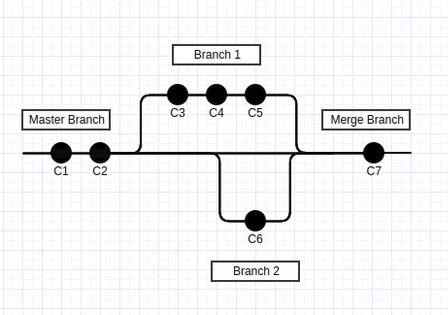

# سامانه‌های کنترل نسخه (VCS)

Version Control System یا VCS یکی از مهم‌ترین سیستم‌های  مورد استفاده در دنیای برنامه‌نویسان امروز است. با یک مثال ساده یکی از ویژگی های مهم این سیستم را بررسی می‌کنیم. فرض کنید یک فایل متنی را ایجاد و چندین بار آن را ویرایش کرده‌اید. در ویرایش پنجم به این نتیجه می‌رسید که ویرایش اول شما بهتر بوده و قصد بازگشت به نسخه‌ای را دارید که در ویرایش اول ایجاد شده است. VCS این امکان را به شما می‌دهد که بی‌نهایت بار اشتباه کنید و بتوانید اشتباهات خود را جبران کنید. به وسیله ی VCS ها شما می‌توانید نسخه‌های متفاوتی از فایل‌های خود داشته باشید و در صورت اشتباه آن را تصحیح کنید.

VCS ها تغییرات و ویرایش های ما را ذخیره‌سازی کرده و به هنگام خطا و در صورت نیاز می‌توانند نسخه های قبلی را بازیابی کنند. همچنین VCS ها با فراهم کردن امکانات زیادی مثل قابلیت پیگیری تغییرات اعمالی هر یک از برنامه‌نویسان، ساخت شاخه‌هایی مختلف از پروژه، جلوگیری از تداخل کدهای برنامه نویسان و …. فرآیند توسعه پروژه‌ها به صورت گروهی را ساده‌تر می‌سازند. اساس کارکرد تمامی VCS ها بر روی ثبت و ذخیره‌سازی تاریخچه ی تغییرات فایل‌هایی است که ما آنها را تغییر می‌دهیم. 

برخی از ویژگی‌های مهم این سیستم‌ها عبارتند از:

1. قابلیت بازگشت به نسخه‌های مختلف از محتویات فایل‌ها
2. کاهش ریسک از دست رفتن فایل در اثر اشتباه 
3. مقایسه نسخه‌های مختلف یک فایل و بررسی تغییرات 
4. پشتیبان‌گیری از انواع فایل‌ها نظیر کدهای یک برنامه کامپیوتری و یا فایل های صوتی و تصویری 


## انواع VCS 

VCS ها به سه دسته **محلی**، **متمرکز** و **توزیع‌شده** تقسیم می‌شوند. در ادامه هر کدام از دسته‌ها بررسی خواهد شد.


*تصویر ۱ - انواع سامانه‌های کنترل نسخه*


### VCS محلی 

ساده‌ترین کاری که یک کاربر می‌تواند برای کنترل نسخ پروژه خود انجام دهد، کپی کردن فایل‌ها داخل یک پوشه جدا (و اگر هوشمندانه باشد، با ثبت ساعت و تاریخ آن لحظه به عنوان نام پوشه) است. علی‌رغم راحتی و سادگی، اینکار مستعد خطا است؛ مثلا کاربر به سادگی می‌تواند مبدا و مقصد عملیات کپی را اشتباه کند و همه چیز خراب شود! یا حتی تغییرات در فایل‌های قدیمی‌تری انجام شود که تغییرات جدیدتر را در خود ندارد!

برای حل این مشکل، برنامه‌نویسان از مدت‌ها پیش سیستم‌های مدیریت نسخه‌ای را توسعه دادند که از یک پایگاه داده ساده برای ثبت تغییرات در فایل‌ها بهره می‌بردند. 


*تصویر ۲ - شمای سامانه کنترل نسخه محلی*


یکی از معروف‌ترین ابزارهای VCS به نام RCS (Revision Control System) است که همچنان بر روی بسیاری از کامپیوترها (عمدتا لینوکسی) یافت می‌شود. RCS با نگهداری مجموعه‌ای از وصله‌ها (Patch؛ تغییرات بین دو نسخه متوالی از فایل) در قالب یک فرمت مشخص بر روی دیسک کار می‌کند. پایگاه داده RCS تنها در اختیار کاربر محلی کامپیوتر قرار دارد؛ بنابراین افراد بیرون از ناحیه ی محلی توانایی استفاده از نسخه‌های این نوع از VCS را ندارند.

از نقاط ضعف این مدل از VCS ها می‌توان به عدم امکان مدیریت پروژه‌های گروهی و همچنین نقطه تکی شکست در آنها اشاره کرد.

<div class="meta-base info">
<p>
به این معنا است که منابع مورد استفاده در یک نقطه تجمیع شده است و در صورتی بوجود آمدن خرابی در آن نقطه، منابع با خطر خرابی یا از بین رفتن مواجه خواهند بود.
</p>
</div>


### VCS متمرکز 

(غیر از نیاز مدیریت فردی پروژه‌ها) نیازی دیگری که کاربران با آن مواجه بودند، همکاری با سایر توسعه‌دهندگان (افرادی که به سیستم محلی کاربر دسترسی نداشتند) بود. برای رفع این نیاز، سامانه‌های کنترل نسخه متمرکز ارائه شدند. این سامانه‌ها از یک سرور که حاوی تمام نسخه‌های فایل‌ها استفاده می‌کند. هر یک از کاربرانی که بر روی یک پروژه مشترک فعالیت می‌کنند، می‌توانند مستقلا با سرور در ارتباط باشند (به صورت ارتباط Client/Server)، تغییرات جدید را دریافت و یا تغییرات خودشان در آن ثبت کنند. برای مثال، در تصویر زیر می‌بینیم که کاربر A و کاربر B به صورت مستقل به سرور VCS مرکزی متصل هستند و عملیات مورد نیاز خود را انجام می‌دهند. برای سال‌های متمادی، VCS های متمرکز به عنوان نوع استاندارد آن شناخته می‌شدند.


*تصویر ۳ - شمای سامانه کنترل نسخه متمرکز*


با این حال، VCS های متمرکز نیز خالی از مشکل نیستند. واضح‌ترین مشکل آنها، بوجود آمدن یک نقطه شکست (Single point of failure) به واسطه متمرکز بودن معماری آنها است؛ اگر سرور برای چند ساعت در دسترس نباشد (مثلا با هدف تعمیرات، بروزرسانی یا حتی خرابی سرور) هیچ کاربری نمی‌تواند نسخه‌های جدید از فایل‌هایش را ذخیره کند. یا حتی بدتر از آن، اگر دیسک سخت سرور خراب شود، تقریبا همه چیز از بین می‌رود!

در این نوع VCS‌ها تمام داده‌ها بر روی یک سرور مرکزی ذخیره می‌شوند و شیوه دسترسی به اطلاعات به صورت Client / Server می‌باشد. یعنی اگر برنامه‌نویسان بخواهند تغییراتی در پروژه ایجاد کنند باید به سرور مرکزی متصل باشند، در غیر اینصورت نمی‌توانند به اطلاعات پروژه دست پیدا کنند.

به طور خلاصه، ویژگی‌های VCS متمرکز عبارتند از:

1. دسترسی چندین کاربر به یک منبع 
2. امکان مدیریت متمرکز بر روی مجوز های دسترسی 

همچنین، برخی از نمونه‌های VCS متمرکز عبارتند از: 

1. CVS 
2. Perforce 
3. Subversion 


### VCS توزیع‌شده

 در یک VCS توزیع‌شده، کاربران نه تنها آخرین تغییرات اعمال‌شده بر فایل‌ها را در از سرور دریافت می‌کنند، بلکه یک نسخه کامل از مخزن (=محلی که مجموعه فایل‌های حاوی نسخه‌های مختلف از یک پروژه در آن قرار داد) به همراه سابقه آن را نیز در سمت خود می‌سازند. بنابراین، در صورت وقوع خرابی در سرور، هر کدام از مخازن ساخته شده سمت کاربران می‌تواند به عنوان پشتیبان در نظر گرفته شده و بازیابی اطلاعات در سرور از طریق آن انجام شود. به عبارت دیگر، هر کاربری که از VCS توزیع‌شده استفاده می‌کند، یک نسخه پشتیبان کامل از تمام داده‌ها را در اختیار دارد. همچنین در صورتی که سرور اصلی در دسترس نباشد، اعضای گروه می‌توانند تغییرات را در سیستم خودشان اعمال کرده و در زمانی که ارتباط دوباره برقرار شد آن را با سرور اصلی هنگام‌سازی کنند.


*تصویر ۳ - شمای سامانه کنترل نسخه توزیع‌شده*


به علاوه، بسیاری از VCS های توزیع‌شده، قابلیت پشتیبانی از چندین مخزن از راه دور را دارند. به این صورت که کاربر می‌تواند بر روی توسعه یک پروژه واحد با تیم‌های مختلفی که آدرس مخزن سرورشان با یکدیگر متفاوت است، همکاری کند.


یکی از مهمترین و پرکاربردترین سیستم های VCS توزیع شده GIT می باشد. نمونه‌های دیگر از VCS توزیع‌شده عبارتند از:

2. Bazaar 
3. Mercurial
4. Darcs 

در تصویر زیر میتوان تاریخچه ی ظهور VCS های توزیع‌شده را مشاهده نمود.


*تصویر ۴ - خط زمانی ظهور VCSهای توزیع‌شده*


در ادامه به بررسی پرکاربردترین VCS موجود یعنی GIT می‌پردازیم. 


## گیت GIT 

همانطور که گفته شد، گیت یک سیستم کنترل نسخه است که به صورت توزیع شده سازماندهی شده است. گیت یکی از ابزار های مهم در زندگی برنامه‌نویسان است و هر برنامه‌نویسی باید آشنایی کاملی با این ابزار مهم داشته باشد.

توسعهٔ گیت زمانی آغاز شد که بسیاری از توسعه‌دهندگان لینوکس، در استفاده از بیت کیپر، که یک سیستم مدیریت کد می‌باشد که قبلاً برای توسعه هستهٔ لینوکس استفاده می‌شد، امتناع ورزیدند. 

در درختواره زیر یک شمای کلی‌ از تاریخچه ی گیت را مشاهده می‌کنید:‌


*تصویر ۵ - درختواره تاریخچه توسعه لینوکس*


گیت برای هماهنگ کردن وظایف میان اشخاص مختلفی که روی یک پروژه کار می‌کنند، بسیار مفید است. می‌توانید از گیت برای نوشتن یک مقاله استفاده کنید، یا وقتی که می‌خواهید تغییراتِ اعمال شده را، در یک فایل هنری یا طراحی، پیگیری کنید.

همانطور که در بخش قبل مورد بررسی قرار گرفت، گیت تنها سیستم کنترل نسخه موجود نیست، اما معروف‌ترین آنهاست. بسیاری از برنامه‌نویسان به صورت روزانه از گیت استفاده می‌کنند و بلد بودن آن می‌تواند تأثیر خوبی روی رزومه‌ی کاری‌تان داشته باشد.

اهداف مهم توسعه گیت عبارتند از:

1. سرعت
2. طراحی ساده
3. پشتیبانی از توسعه غیر خطی: یعنی چندین شاخه از یک پروژه را بتوان به صورت موازی پیش برد
4. توزیع شدگی کامل 
5. توانایی مدیریت پروژه های بزرگ (‌مثل کرنل سیستم عامل لینوکس)


## نگهداری داده‌ها در گیت

مهمترین تفاوت بین GIT و سایر VCSها (مانند SVN)، دیدگاه نسبت به داده‌های ذخیره‌سازی شده است. در اکثر VCSها، اطلاعات به شکل لیستی از تغییرات فایل-محور ذخیره می‌شود. در واقع، این ابزارها به اطلاعات به چشم مجموعه‌ای از فایل‌ها و تغییراتی نگاه می‌کنند که در گذر زمان در فایل‌های اولیه اتفاق می‌افتند. به این روش کنترل نسخه اصطلاحا **تغییر-محور** گفته می‌شود.

تصویر زیر یک سناریوی ساده از این مدل ذخیره‌سازی را شرح می‌دهد؛ در نسخه ۱، ۳ فایل A، B و C وجود داشته‌اند. بعد از مدتی، فایل‌ها A و C دچار تغییر شده و تغییرات رقم خورده در این دو فایل در نسخه ۲ ذخیره می‌شوند. از آنجایی که فایل B تا زمان ثبت نسخه ۲ تغییری نداشته است، اطلاعات جدیدی از آن در نسخه ۲ اضافه نمی‌شود.  به همین منوال، عملیات ثبت نسخ جدید در آینده نیز ادامه پیدا می‌کند.


*تصویر ۶ - ذخیره‌سازی اطلاعات به شکل تغییرات نسبت به نسخه پایه هر فایل*


بر خلاف VCSهای مبتنی بر دیدگاه تغییر-محور، GIT به اطلاعات به چشم جریانی از لحظه‌نگارهای (Snapshot) یک فایل‌سیستم مینیاتوری نگاه می‌کند. هر زمان که آماده ایجاد نسخه جدید می‌شوید و حالت فعلی پروژه خود را ذخیره می‌کنید، GIT در آن لحظه یک تصویر (=لحظه‌نگار) از تمام فایل‌های شما ثبت کرده و اشاره‌گری به آن را ذخیره می‌کند. برای کارایی بیشتر، فایلی که تغییری نداشته است، در لحظه‌نگار جدید ثبت نمی‌شود و تنها ارجاعی به همان فایل در نسخه قبلی را در آن نگهداری می‌نماید.

در تصویر زیر، می‌توانیم سناریوی مبتنی بر مدل ذخیره‌سازی اطلاعات در GIT را مشاهده کنیم؛ در نسخه ۱، تمام فایل‌های پروژه ثبت می‌شوند. در نسخه ۲، تنها فایل‌های A و C تغییر یافته است؛ لذا در لحظه‌نگار مربوط به نسخه ۲، کل فایل‌های A و C و لینک به فایل‌ B در نسخه ۱، در نظر گرفته خواهند شد. در نسخه ۳، تنها فایل C تغییر یافته است؛ لذا کل فایل C به همراه لینک‌های فایل B در نسخه ۱ و فایل B در نسخه ۲ در لحظه‌نگار مربوطه ذخیره خواهند شد.


*تصویر ۷ - ذخیره‌سازی اطلاعات به شکل جریانی از لحظه‌نگارها در طول انجام پروژه*


## نصب گیت

ابزار گیت (تقریبا) در هر سیستم عاملی قابل نصب است. در ادامه، راهنمای نصب مربوط به دو سیستم عامل ویندوز و توزیع‌ لینوکسی Ubuntu آورده شده است.


### طریقه نصب در ویندوز 

برای نصب گیت در سیستم عامل ویندوز باید در از طریق سایت رسمی [گیت](https://git-scm.com/download/win) نسخه مربوط به سیستم عامل خود را دانلود و به شکل زیر آن را نصب کنید. 

 


*تصویر ۹ - مراحل نصب گیت در سیستم عامل ویندوز*


پس از اتمام مراحل نصب به شکل بالا Git Bash نیز در ویندوز به صورت خودکار نصب شده است. با استفاده از Git bash میتوان دستورات مهم لینوکسی را در محیط سیستم عامل ویندوز اجرا کرد .(تصویر زیر)


*تصویر ۱۰ - بررسی نسخه گیت نصب‌شده*


### طریقه نصب در Ubuntu

در سیستم عامل لینوکس و در نسخه ی Ubuntu با استفاده از دستور زیر میتوان گیت را نصب کرد :‌

```bash
sudo apt-get update 
sudo apt-get install git 
```

در سایر توزیع‌های لینوکسی نیز بسته به مدیریت پکیج آن، می‌توان اقدام به نصب گیت کرد. برای مثال، در نسخه‌های redhat نیز به شکل زیر می‌توان گیت را نصب کرد. 

```bash
sudo yum install git 
```


## اصطلاحات مهم
قبل از آغاز کار با گیت و بررسی امکانات آن به صورت عملی، می‌بایست با اصطلاحات حیاتی و مهم آن آشنایی پیدا کنیم. تعدادی از مهمترین این اصطلاحات در ادامه آورده شده است.


### مخزن یا Repository 

مخزن در بردارنده ی سابقه ی کلی پروژه ی شماست. تمام تغییرات شما در یک پروژه بر روی فایل ها در یک مخزن قابل مشاهده است.

<p align="center">
  
</p>
*تصویر ۱۱ - مخزن*


دو نوع مخزن داریم:

1. **محلی**: این نوع مخزن روی ماشین و کامپیوتر شما ذخیره می‌شود و می‌توان به صورت مستقیم به آن دسترسی داشت. 
2. **از راه دور** (ریموت): این نوع از مخزن ها در واقع یک سرور هستند که افراد مختلف می‌توانند به آن متصل شده و تغییرات را دریافت کنند.


### اصلاح Revision 

در گیت تغییرات نسبت به نسخه های قبلی ذخیره میشود و هر تغییر تحت عنوان یک revision ذخیره میشود. revision ها یک نویسنده ی مشخص دارند و علاوه بر این حاوی پیامی است که توضیحات مربوط به تغییرات این نسخه است که توسط نویسنده بیان شده است.

<p align="center">
  
</p>

*تصویر ۱۲ - اصلاح*


### برچسب Tag 

پس از چندین اصلاح ممکن است به یک اصلاح خاص برسیم (مثلا ممکن است پس از چندین اصلاح یک نسخه از پروژه تولید شود که بخواهیم آن را به شکلی متمایز کنیم) پس از رسیدن به این نسخه در طی فرآیند توسعه می‌توان این نسخه ی خاص را به وسیله یک برچسب مشخص کرد.


*تصویر ۱۳ - برچسب*


### شاخه Branch 

سناریوی زیر را در نظر بگیرید. فرض کنید شما و دوست برنامه‌نویس‌تان قصد دارید روی یک پروژه کار کنید و قسمت‌های مختلف را بین خود تقسیم می‌کنید. برای این که شما دو نفر به صورت موازی بتوانید وظایف خود را پیش ببرید هر کدام یک شاخه ایجاد کرده و تغییرات را روی شاخه ی مربوط به خودتان انجام می‌دهید. استفاده از شاخه در گیت خصوصا در پروژه‌هایی که به صورت گروهی انجام می‌گیرد، بسیار ضروریست. 


*تصویر ۱۴ - شاخه*


برای درک بهتر در تصویر بالا فرض کنید شاخه ی سمت چپ را شما و شاخه ی سمت راست را دوستتان توسعه داده است.


### ایجاد تغییر در پروژه و اعمال آن 

فرض کنید یک پروژه را که دارای گیت است در اختیار شما قرار داده‌اند و وظایفی به شما در مورد پروژه محول شده است. برای ایجاد تغییر ابتدا باید یک از کپی از پروژه را دریافت کرده و سپس تغییرات را اعمال کنید.

فایل هایی که در یک پروژه وجود دارند از نظر گیت در یکی از سه دسته زیر جای می‌گیرند: 

1. **Working Area**: فایل هایی که در پوشه ی پروژه موجود هستند ولی گیت آنها را دنبال نمی‌کند. 
2. **Staging Area**: فایل هایی که گیت آنها را دنبال می‌کند.
3. **Commited Area**: فایل هایی که گیت تغییرات آنها را دنبال و ذخیره می‌‌کند.


*تصویر ۱۵ - دسته‌بندی فایل‌‌ها از دیدگاه گیت*


حال برای ایجاد تغییرات در یک پروژه ی تحت گیت باید آن را در یک Working Directory ایجاد کنیم و سپس فایل‌هایی که میخواهیم گیت تغییرات آنها را نظاره کند به Staging Area اضافه و اگر می‌خواهیم تغییری را ذخیره کنیم تغییرات فایل را در Commited Area ذخیره می‌کنیم. 


*تصویر ۱۶ - شمای شاخه اصلی*


در تصویر بالا فرض کنید که یک پروژه ی تحت گیت داریم که شاخه ی اصلی آن مشخص شده است و می‌خواهیم تغییرات خود را اعمال و ذخیره کنیم. بنابراین، آخرین نسخه ی پروژه را دریافت می‌کنیم و پس از آن تغییرات خود را در پروژه اعمال می‌کنیم:


*تصویر ۱۷ - دریافت آخرین نسخه پروژه*


*تصویر ۱۸ - اعمال تغییرات بر روی فایل‌های پروژه*


*تصویر ۱۹ - اعمال تغییرات روی مخزن*


پس از اعمال تغییرات، آنها را به عنوان یک کامیت به پروژه اضافه می‌کنیم (به بیان دیگر فایل‌های تغییر داده شده به Commited Area اضافه می‌شوند)

بنابراین فایل های پروژه می‌توانند یکی از ۴ حالات زیر را داشته باشند:

- **Untracked**: داخل Working Area هستند ولی توسط گیت رصد نمی‌شوند.
- **Unmodified**: از لحظه‌نگار قبلی تاکنون تغییر نکرده است.
- **Modified**: تغییر کرده است ولی هنوز در پایگاه داده ثبت نشده است.
- **Staged**: تغییر کرده است و آماده ی ثبت در لحظه‌نگار بعدی است.


*تصویر ۲۰ - حالات مربوط به فایل‌های پروژه*


## ساخت مخزن
پس از این که مفهوم مخزن را متوجه شدیم، لازم است بتوانیم یک مخزن را ایجاد و سپس با آن پروژه ی خود را مدیریت کنیم. با استفاده از دستور یک یک مخزن در پوشه ی `myrepository` می‌سازیم: 

```bash
git init myrepository
```

این دستور یک پوشه به نام `myrepository` می‌سازد و مخزن اصلی در مسیر `myrepository/.git` ذخیره می‌شود. فایل های پروژه نیز در مسیر `myrepository` قرار می‌گیرد. (چون در ابتدا فایلی نداریم، پوشه خالی خواهد بود.)

مثالی را از این لحظه شروع می‌کنیم. ابتدا اطمینان حاصل می‌کنیم که در مسیری هستیم که می‌خواهیم پروژه را ایجاد کنیم:

```bash
cw@testing:~$ pwd
/home/cw/
```

دستور `pwd` (که یک دستور لینوکسی است) به ما اعلام می‌کند که مسیر فعلی چیست (با این دستور در مبحث لینوکس بیشتر آشنا می‌شویم). خروجی دستور بالا در یک ماشین لینوکسی معنا پیدا می‌کند. در یک ماشین ویندوزی (و با استفاده از Git Bash)، خروجی به این شکل خواهد بود:

```bash
cw@testing: MINGW64 ~
$ pwd
/c/Users/cw
```

در ادامه مثال، یک مخزن گیت درون پوشه‌ای با نام `project` می‌سازیم: 

```bash
cw$testing:~$ git init project
Initialized empty Git repository in /home/cw/project/.git/
```

سپس بررسی می‌کنیم که در پوشه `project` که ساخته شده چه چیزهایی وجود دارد:

```bash
cw@testing:~$ ls -a project
.  ..  .git
```

سه پوشه در پوشه `project` وجود دارد؛ `.`، `..` و `.git`. با دو پوشه اول در مبحث لینوکس آشنا خواهید شد. همینقدر بدانید که پوشه `.git` محلی است که مخزن پروژه `project` در آن قرار دارد.

می‌توانید محتویات پوشه مخزن را نیز ببینید که در این درس از بررسی آنها چشم‌پوشی می‌کنیم:

```bash
cw@testing:~$ ls -a project/.git
branches  config  description  HEAD  hooks  info  objects  refs
```


در صورتی که ورودی دستور `git init` خالی باشد مخزن در پوشه ی فعلی (که در آن قرار داریم) ذخیره می‌شود. به عبارتی، در مثال قبل می‌توانستیم ابتدا پوشه `project` را ایجاد کنیم و سپس یک مخزن درون آن ایجاد کنیم.

<div class="meta-base warning">
<p>
پوشه ی .git حاوی کلیه ی اطلاعات مهم پروژه توسط گیت است و نباید هیچ وقت آن را حذف کنید . در صورت حذف آن، کلیه ی سوابق پروژه و تغییرات آن از بین می‌رود.
</p>
</div>


## ثبت مشخصات کاربر 

پس از نصب گیت و پیش از هر کاری، می‌بایست اطلاعات خود را که شامل یک ایمیل و یک نام کاربری است در تنظیمات مخزن ثبت کنید: 

```bash
git config --global user.email "youremail"
git config --global user.name "yourusername"
```

با اینکار، شما به صورت سراسری ایمیل و نام کاربری‌تان را برای هر پروژه‌ای که تحت گیت باشد، تنظیم می‌کنید. اگر مایل به تنظیم سراسری این موارد نیستید یا می‌خواهید این تنظیمات را برای پروژه‌ای تغییر دهید، دستور بالا را بدون سوییچ `--global` و در پوشه پروژه مورد نظر، اجرا کنید. برای مثال، دستورات بالا را به این شکل وارد می‌کنیم:

```bash
cw@testing:~/project$ git config user.email "testing@cw.com"
cw@testing:~/project$ git config user.name "tester"
```


## ایجاد و ثبت تغییرات 

پس از مقداردهی اولیه مخزن، در پوشه ی مربوط به پروژه تغییرات خود را اعمال کنید. برای افزودن فایل (یا فایل‌های) خود به Staging Area از دستور زیر استفاده می‌کنیم:

```bash
git add file [file1] [file2] ... 
```

برای مثال، فایل `hello` را می‌سازیم و به پروژه اضافه می‌کنیم:

```bash
cw@testing:~/project$ echo 'Hello World!' > hello
cw@testing:~/project$ git add hello
```

برای ثبت حالت فعلی پروژه (ایجاد لحظه‌نگار جدید)، از دستور زیر استفاده می‌کنیم:

```bash
git commit -m [your-commit-message]
```

در ادامه مثال قبلی، ثبت کامیت را به صورت زیر انجام می‌دهیم:

```bash
cw@testing:~/project$ git commit -m "added file 'hello'"
[master (root-commit) 28de2e5] added file 'hello'
 1 file changed, 1 insertion(+)
 create mode 100644 hello
```

میتوان به جای اضافه کردن تک به تک فایل‌ها،  از کاراکتر نقطه `.` استفاده کنیم. با اینکار، تمامی فایل‌هایی که یا در مسیر فعلی قرار دارند، یا محل قرارگیری آنها جزو زیرمجموعه‌های مسیر فعلی است، به Staging Area اضافه می‌شوند:

```bash
git add . 
```

برای هر کامیت **باید** یک پیام وارد شود. این پیام شامل یک توضیح در مورد تغییری است که شما در فایل ها ایجاد کرده‌اید.


## گزارش تغییرات

با استفاده از دستور زیر می‌توان اطلاعات کلی کامیت‌هایی که اخیرا در پروژه اعمال شده است را مشاهده کنیم:

```bash
git log 
```

اجرای این دستور منجر به این خروجی خواهد شد:

```bash
cw@testing:~/project$ git log
commit 28de2e5cf7fc12a499484165b71fbbe8940799bc (HEAD -> master)
Author: tester <tester@cw.com>
Date: Mon Sep 27 18:44:01 2021 +0330
	
	added file `hello`
```


## گزارش وضعیت 

با استفاده از دستور زیر می‌توان اطلاعات زیادی را در مورد مخزن دریافت کرد.

```bash
git status
```

اطلاعات قابل نمایش توسط این دستور عبارتند از:

- شاخه کنونی 
- وضعیت تازگی اطلاعات نسب به سرور 
- فایل‌های تغییر یافته (Modified)  ولی نشان نشده (‌Unstaged)
- فایل‌های تغییر یافته و آماده ی ثبت

پس از اجرای دستور بالا خروجی زیر ظاهر می‌شود:

```bash
cw@testing:~/project$ git status
On branch master
nothing to commit, working tree clean
```

طبیعی است که چیزی برای کامیت شدن وجود نداشته باشد نباشد؛ تغییر جدیدی رخ نداده است. حال یک فایل جدید ایجاد می‌کنیم تا وضعیت را مجددا بسنجیم:

```bash
cw@testing:~/project$ echo "Hello Universe!" > universe
cw@testing:~/proejct$ git status
On branch master
Untracked files:
  (use "git add <file>..." to include in what will be commited)
        universe

nothing added to commit but untracked files present (use "git add" to track)
```

با دستورات بالا، فایل `universe` را ایجاد و دستور `git status` را مجددا اجرا کردیم. همانطور که مشاهده می‌شود، فایل تازه ایجاد شده ی `universe` توسط گیت رصد نمی‌شود. برای اضافه کردن این فایل به مجموعه ی Staged Area از دستور `git add` استفاده کرده و سپس وضعیت را دوباره می‌سنجیم:

```bash
cw@testing:~/project$ git add universe
cw@testing:~/project$ git status
On branch master
Changes to be committed:
  (use "git restore --staged <file>..." to unstage)
        new file:   universe
```

پس از اضافه شدن، وضعیت فایل `universe` تغییر کرد و تغییرات این فایل توسط گیت دنبال می‌شود. حال محتویات فایل `hello` (که قبلا ساخته شده است) را تغییر می‌دهیم و وضعیت را دوباره بررسی می‌کنیم:

```bash
cw@testing:~/project$ echo "Hello again" >> hello
cw@testing:~/project$ git status
On branch master
Changes to be committed:
  (use "git restore --staged <file>..." to unstage)
        new file:   universe

Changes not staged for commit:
  (use "git add <file>..." to update what will be committed)
  (use "git restore <file>..." to discard changes in working directory)
        modified:    hello
```

همانطور که مشاهده می‌شود فایل `hello` آماده ی ثبت نیست. برای ثبت فایل‌های تغییر یافته در هنگام کامیت میتوان از سوییچ `-a` استفاده کرد:

```bash
cw@testing:~/project$ git commit -am "added file 'universe'"
[master 524757a] added file 'universe'
 2 files changed, 2 insertions(+)
 create mode 100644 universe
cw@testing:~/project$ git status
On branch master
nothing to commit, working tree clean
cw@testing:~/project$ git log
commit 523757a046e5f44aeed6131e516ffb37e694dcfa
Author: tester <tester@cw.com>
Date: Mon Sep 27 20:03:41 2021 +0330

    added file 'universe'

commit 28de2e5cf7fc12a499484165b71fbbe8940799bc
Author: tester <tester@cw.com>
Date: Mon Sep 27 18:44:01 2021 +0330
    
    added file 'hello'
```

در صورتی که از سوییچ ‍`-a` استفاده نکنیم، تغییراتی که در فایل `hello` داشتیم ثبت نمی‌شدند:

```bash
cw@testing:~/project$ git commit -m "added file 'universe'"
[master 771d323] added file 'universe'
 1 file changed, 1 inserstion(+)
 create mode 100644 universe
cw@testing:~/project$ git status
On branch master
Changes not staged for commit:
  (use "git add <file>..." to update what will be committed)
  (use "git restore <file>..." to discard changes in working directory)
        modified:   hello

no changes added to commit (use "git add" and/or "git commit -a")
```

یک راه دیگر آن بود که پس از تغییر فایل `hello` مجددا آن را با دستور `git add` به Staging Area اضافه کنیم.

```bash
git add hello
```

## ساخت شاخه
مفهوم شاخه را پیش از این توضیح دادیم. در این قسمت به صورت عملی یاد می‌گیریم که چگونه یک شاخه را از پروژه ی خود ایجاد و روی آن کار کنیم.

هنگامی که یک مخزن ایجاد می‌کنیم، به صورت پیش‌فرض یک شاخه ی `master` ساخته می‌شود که نقش شاخه اصلی مخزن مذکور را بازی می‌کند و هر کامیتی که انجام دهیم روی این شاخه انجام می‌شود. یکی از مزایای وجود شاخه‌ها در سیستم کنترل نسخهٔ گیت آن است که می‌توان به تعداد توسعه‌دهندگانی که در تیم حضور دارند شاخه‌های اختصاصی ساخته و در آن واحد تمامی اعضای تیم بتوانند اقدام به پیشبرد پروژه کنند.

<div class="meta-base info">
<p>
در توسعه ی پروژه، فقط باید کدهایی روی شاخه اصلی قرار گیرد که کاملا پایدار و بدون مشکل هستند. با این تفاسیر منطقی به نظر میرسد که شاخه master به عنوان شاخه ی آزمون و خطا استفاده نشود و هنگامی که یکی از اعضای تیم قصد توسعه ی نرم افزار را داشت شاخه ی جدایی را ایجاد کرده و روی آن ادامه دهد تا هنگامی که به پایداری اشاره شده برسد.
</p>
</div>





همان‌طور که در تصویر فوق ملاحظه می‌شود، خط عمودی که در سراسر نمودار مشاهده می‌شود به عنوان شاخه اصلی یا `master` است. فرض می‌کنیم توسط توسعه‌دهندهٔ اصلی پروژه، کامیت‌هایی تحت عناوین C1 و C2 انجام شده است. سپس یک شاخه از شاخهٔ اصلی جدا شده و نامی دلخواه همچون `Branch1` برای آن در نظر گرفته‌ایم (که فرضاً توسط یکی از اعضای تیم توسعه داده می‌شود) به طوری که وی سه کامیت داخل این شاخه انجام داده است. به صورت موازی،‌ برای یکی دیگر از اعضای تیم شاخه‌ای به نام Branch2 ساخته شده و او نیز یک کامیت در این شاخه انجام داده است. در نهایت، دولوپر اصلی این پروژه کلیهٔ تغییرات اِعمال‌شده در دو شاخه فوق را با شاخه اصلی (`master`) ادغام کرده و مجموع این تغییرات را تحت عنوان C7 در شاخه اصلی کامیت کرده است.

حال که با مفهوم شاخه به صورتی بهتر آشنا شدیم بهتر است چند دستور آن را نیز بررسی کنیم. برای آن لیستی از شاخه‌های پروژه را مشاهده کنیم دستور زیر را اجرا می‌کنیم:‌

```bash
cw@testing:~/project$ git branch
* master
```

دستور `git branch` لیستی از کلیه ی شاخه‌ها را نمایش می‌دهد و همانطور که گفته شد، شاخه ی `master` به صورت پیش‌فرض نمایش داده شده است. علامت `*` تایید می‌کند که در حال حاضر، روی این شاخه هستیم.

فرض کنید که می‌خواهیم شاخه ی دیگری از شاخه ی اصلی انشعاب بگیریم تا وظایف خود را روی آن شاخه ادامه دهیم. به شکل زیر عمل کرده و شاخه ی `branch1` را ایجاد می‌کنیم:

```bash
cw@testing:~/project$ git branch branch1
```

پس از ایجاد شاخه ی مورد نظر، یک بار دیگر لیست شاخه‌ها را نمایش می‌دهیم:

```bash
cw@testing:~/project$ git branch
* master
  branch1
```

همانطور که مشاهده می‌شود، شاخه ی branch1 ساخته و در لیست شاخه ها نمایان شده است. توجه کنید که با دستور مورد نظر شاخه ی جدید ساخته می‌شود ولی ما کماکان روی شاخه ی master قرار داریم. برای تغییر شاخه از دستور زیر استفاده می‌کنیم‌:

```bash
cw@testing:~/project$ git checkout branch1 
Switched to branch 'branch1'

```

سپس لیست شاخه‌ها را دوباره نمایش می‌دهیم‌: 

```bash
cw@testing:~/project$ git branch 
  master
* branch1
```

بدین ترتیب با توجه به این که علامت ستاره روی branch1 قرار دارد، پس ما الان روی شاخه ی branch1 هستیم.

از این پس (و تا زمانی که شاخه فعلی را تغییر نداده‌ایم) هر کامیتی که اعمال کنیم، روی همین شاخه اضافه می‌شود. برای آنکه در عمل هم متوجه این موضوع شویم، یک فایل متنی ایجاد می‌کنیم؛ سپس آن را کامیت می‌کنیم تا ببینیم تغییرات در کدام شاخه اعمال می‌شود:

```bash
cw@testing:~/project$ git add new.txt
cw@testing:~/project$ git commit -m "new file added"
[branch1 b276cac] new file added
 1 file changed, 3 insertions(+)
 create mode 100644 new.txt
```

سپس گزارش تغییرات شاخه را با دستور log چک می‌کنیم:

```bash
cw@testing:~/project$ git log --oneline
b276cac (HEAD -> branch1) new.txt
23d2256 (master) a new line added
fd728ca Yet another commit
```

همانطور که می‌بینیم در پیامی که برای کامیت آمده است، مشاهده می‌شود که تغییرات روی branch1 اعمال شده است و نه شاخه master.

حال مجددا به شاخه ی master رجوع می‌کنیم تا ببینیم آیا فایل مورد نظر در این شاخه نیز وجود دارد یا خیر: 

```bash
cw@testing:~/project$ git checkout master 
Switched to branch 'master'
```

اکنون اگر به محتویات داخل پوشه نگاهی بیندازیم،‌ خواهیم دید که فایل new.txt حذف شده است و این مسئله از آنجا ناشی می‌گردد که ما این فایل را در شاخه branch1 افزوده‌ایم و شاخه master هیچ اطلاعی از این موضوع ندارد.

## حذف شاخه
با استفاده از سوییچ -d میتوان یک شاخه را حذف کرد. در ادامه مثال قبل، سعی می‌کنیم تا شاخه ای که ایجاد کرده‌ایم، حذف کنیم:

```bash
cw@testing:~/project$ git branch -d branch1
error: The branch 'branch1' is not fully merged.
If you are sure you want to delete it, run 'git branch -D branch1'.
```

همانطور که مشاهده می‌کنید شاخه ی branch1 حذف نشد و گیت هشدار می‌دهد که تغییراتی که در آن شاخه اعمال شده است هنوز با شاخه ی master ادغام یا merge نشده است.

<div class="meta-base notice">
<p>
توجه:‌ اگر از آپشن D (به صورت حروف بزرگ) در دستور استفاده کنیم بدون توجه به ادغام این دو شاخه آن را حذف میکند.
</p>
</div>

بعد از حذف، اگر نگاهی دوباره به شاخه ها بیندازیم، می‌بینیم که شاخه ی branch1 حذف شده است:‌

```bash
cw@testing:~/project$ git branch
* master
```

حال حالت دیگری را بررسی می‌کنیم؛ فرض کنید قبل از حذف شاخه، بخواهیم آن را با شاخه ی master ادغام کنیم. برای این کار هنگامی که روی شاخه ی اصلی قرار داریم از دستور merge استفاده می‌کنیم. این دستور شاخه ی branch1 را با شاخه ی اصلی (master) ادغام می‌کند و خود به خود شاخه ی branch1 را حذف می‌کند.

<div class="meta-base info">
<p>
مفهوم شاخه‌ها در گیت را به نوعی می‌توان به عنوان یکی از کلیدی‌ترین خصیصه‌های این سیستم کنترل نسخه تلقی کرد؛ چرا که اساساً این امکان در اختیار تیم‌های مهندسی قرار می‌گیرد تا بتوانند به هر تعداد که بخواهند شاخهٔ جدید ایجاد کرده و افراد متعددی به صورت همزمان و موازی روی پروژه کار کنند.
</p>
</div>

## گیتهاب 

پیش از این اشاره کردیم که دو نوع مخزن داریم؛ محلی و از راه دور (ریموت). [گیتهاب](https://github.com/) (Github) یک مخزن تحت وب است که به شما اجازه می‌دهد تا پروژه‌های خود را به صورت ریموت در اختیار دیگران قرار دهید. در ادامه ی این موضوع، فرض کنید که دو نفر بر روی یک پروژه ی مشترک کار می‌کنند که یکی در یک شهر و دیگری در شهری دیگر زندگی می‌کند. گیتهاب این امکان را فراهم می‌کند که این دو نفر، مخازن خود را با یکدیگر اشتراک بگذارند.

برای این که یک مخزن ریموت در گیتهاب درست کنید باید ابتدا در این وبسایت ثبت نام کنید و سپس با استفاده دکمه ی سمت راست و کنار تصویر پروفایل new repository را کلیک کنید. 

<p align="center">
  
</p>


پس از کلیک بر روی این دکمه صفحه ی زیر باز می‌شود که اطلاعات مربوط به مخزن یعنی نام پروژه و دیگر ویژگی‌ها از جمله عمومی و یا خصوصی بودن آن را باید مشخص کنید و سپس مخزن را ایجاد کنید.


پس از ایجاد مخزن برای این که فایل های خود را روی مخزن قرار دهیم تا دیگران بتوانند به آن دسترسی داشته باشند، باید ابتدا آدرس مخزن ریموت خود را به مخزن محلی خود اضافه کنیم تا مخزن محلی به مخزن ریموت متصل شود. برای این کار از دستور زیر استفاده می‌کنیم:

```bash
git remote add origin git@github.com:ROF13ThFloor/TestRepo.git
```

پس از اضافه شدن مخزن ریموت گیتهاب، باید کدهای کامیت شده ی خود را به گیتهاب اضافه کنیم. برای این کار از دستور push استفاده می‌کنیم:

```bash
git push -u origin main
```

## دستورات fetch/pull 
همانطور که گفته شد Staging Area محدوده‌ای است که فایل‌های موجود در این ناحیه تحت نظاره گیت قرار گرفته‌اند و گیت تغییرات آنها را بررسی می‌کند. همچنین گفته‌شد که با استفاده از دستور ‌`git add` می‌توان یک فایل را به Staging Area اضافه کرد. پس از آن و با استفاده از دستور `git commit` و تعیین پیام آن، تغییرات در محیطی تحت عنوان Local Git Repository ذخیره می‌شود. در این قسمت تمامی تغییرات بر‌ روی نسخه‌ ی محلی (= روی ماشین‌ شما) ذخیره شده‌ است و نسخه‌ ی ریموت ‌تغییری نکرده‌ است. همچنین در قسمت قبل گفتیم که می‌توانیم با استفاده از دستور push تغییرات نسخه‌ ی محلی را روی نسخه‌ ی ریموت هم اعمال کنیم. 

برای درک بهتر روند اضافه‌شدن به Staging Area تا اضافه‌ شدن به مخزن ریموت، تصویر زیر را مشاهده کنید.


*تصویر - مراحل ثبت تغییرات و ارسال آن به مخزن از راه دور*


سناریوی زیر را در نظر می‌گیریم: 

فرض کنید علی و محمد دو نسخه‌ی یکسان از یک برنامه یا فایل را در کامپیوتر خود در اختیار دارند. علی مدتی روی قسمتی از کد کار می‌کند و به محمد می‌گوید که پس از تکمیل این بخش از کد آن را در گیتهاب قرار می‌دهد تا محمد بتواند با دریافت آن ادامه‌ ی کدی که علی نوشته‌است را توسعه دهد. پس از تغییراتی که علی داده‌ است آن را با دستور push روی گیت‌هاب قرار می‌دهد و به محمد خبر می‌دهد. سوالی که پیش می‌آید این‌ است که محمد چگونه باید تغییراتی که علی داده‌ است را دریافت کند؟ نسخه‌ای که محمد در اختیار دارد نسخه‌ ی پیش از توسعه ی علی است. 

محمد برای دریافت تغییرات باید از دستور زیر استفاده کند:‌

```bash
git fetch 
```

پس از اجرای دستور بالا در کامپیوتر محمد، می‌توان تغییراتی که علی داده است را مشاهده کرد، لازم به ذکر است که با اجرای دستور بالا کدی که روی کامپیوتر محمد است تغییری نمی‌کند و ما فقط میتوانیم تغییراتی که علی داده‌ است را مشاهده کنیم (تغییراتی که علی داده‌ است را دریافت ولی آن را اعمال نمی‌کند). برای این که تغییراتی که علی داده‌ است را روی کامپیوتر محمد هم داشته باشیم‌ (کد محمد دچار تغییر شود) از دستور زیر استفاده می‌کنیم.

```bash
git pull origin master
```

در این دستور گفته می‌شود که تمامی تغییراتی که روی آدرس ریموت یعنی origin (که در قسمت قبل آن را اضافه کردیم) داشتیم را روی شاخه‌ی اصلی (master) اعمال شود.

در واقع دستور pull علاوه بر این‌ که تغییرات را دریافت می‌کند (fetch) آن‌ها را اعمال نیز می‌کند.

اگر بخواهیم باقی شاخه‌های موجود نیز به روزرسانی شوند از دستور زیر استفاده می‌کنیم:

```bash
git pull
```

بدین ترتیب محمد تمام تغییراتی که علی داده‌بود را دریافت می‌کند و می‌تواند روی آن ادامه‌ دهد. این تغییرات شامل اضافه‌شدن شاخه‌ها نیز می‌باشد.


### دستور دریافت یک پروژه از مخزن ریموت (Clone)
فرض کنید پروژه‌ای را در گیتهاب مشا‌هده کرده‌اید که قصد دریافت آن‌ را دارید (یعنی این پروژه اکنون روی کامپیوتر شما نیست). برای دریافت پروژه، به صفحه‌ی مرتبط با آن در گیتهاب مراجعه کنید و آدرس مخزن را (همانند تصویر زیر) دریافت کنید. 


همانطور که در تصویر می‌بینید روی دکمه‌ی code کلیک کنید و آدرس https را کپی کنید. سپس در ترمینال با استفاده از دستور زیر پروژه را دریافت کنید (لینک دریافت مخزن برای کاربر و پروژه‌های دیگر، متفاوت خواهد بود).

```bash
git clone <repository-link>
```

پس از اجرای دستور بالا، گیت از شما نام‌ کاربری و رمز عبور گیتهاب را درخواست می‌کند که پس از وارد کردن آنها پروژه‌ی مذکور در پوشه‌ی فعلی دریافت می‌شود.


همانطور که مشاهده می‌شود پروژه‌ی `CreateRaid05Script` در پوشه‌ ی فعلی دریافت‌ شد.

## دستور بازنشانی reset
این دستور، یک دستور چندمنظوره برای لغو تمامی تغییراتی است که اعمال کرده‌ایم. فرض کنید که در بازه‌ای شما تغییراتی را در برنامه‌ی خود اعمال کرده‌اید که اشتباه‌ بوده‌ است و الان متوجه اشتباه‌‌ بودن آن شده‌اید. اگر قصد دارید تغییراتی که اعمال کرده‌اید را پاک کنید و به  آخرین کامیتی که که انجام داده‌اید بازگردید، از دستور زیر استفاده کنید.  

```bash
git reset [commit-hash]
```

هر کامیت با یک رشته شبه تصادفی (hash) مشخص می‌شود که منحصر به‌ فرد است. hash هر کامیت را می‌توان با استفاده از دستور `git log` نیز مشاهده کرد. دستور `git reset` سه نوع سوییچ به عنوان ورودی می‌تواند دریافت کند: 

### سوییچ --hard 
این سوییچ باعث می‌شود که تغییراتی که استیج‌شده هستند و یا هنوز استیج‌نشده باقی‌ماندند لغو می‌شوند. 

```bash
git reset --hard HEAD
```

به جای HEAD می‌توان از هر commit hash موجودی استفاده کرد. برای مثال در شکل زیر با اجرای دستور زیر تمامی کامیت‌های بعد از b از دست خواهند رفت. علاوه بر این تمامی فایل‌هایی که stage شده هستند و یا هنوز stage نشده‌اند نیز حذف می‌شوند و تاریخچه‌ی کامیت‌ها به کامیت b تغییر می‌کند.

```bash
git reset --hard [b]
```

### سوییچ --mixed
این سوییچ تمام فایل‌ها را در حالت فعلی نگه‌داری می‌کند ولی آن‌ها را از حالت stage شده خارج ‌می‌کند. 

```bash
git reset --mixed [b]
```

برای درک بهتر این قسمت فرض کنید شاخه‌ی master شامل سه کامیت A,B,C باشد که آخرین کامیت C می‌باشد. در صورتی که از دستور بالا استفاده کنیم تمامی تغییراتی که داده‌ایم و آن‌ها را پیش از این Stage کرده‌ایم از حالت Stage خارج  می‌شوند.در این حالت همچنان تغییرات قابل مشاهده است اما Stage شده نیستند.

### سوییچ --soft 
این سوییچ همچنان تغییرات را نگه‌داری می‌کند و حتی فایل‌هایی که Stage شده‌اند را هم در حالت Stage نگه‌داری می‌کند .در دستور زیر b همان commit hash است.

```bash
git reset --soft [b]
```

برای درک بهتر تفاوت این سه سوییچ می‌توانید از تصویر زیر استفاده‌ کنید.


## دستور checkout
برای جابه‌جایی بین شاخه‌ها و کامیت‌هایی که طریقه‌ی ایجاد آن‌ها را گفتیم از دستور checkout استفاده می‌کنیم. همچنین از این دستور برای ایجاد یک شاخه و پریدن روی آن نیز می‌توان استفاده کرد.

```bash
git checkout -b Branch1
```

با استفاده از دستور بالا یک شاخه به نام Branch1 از شاخه‌ی فعلی که روی آن هستیم درست می‌شود. علاوه بر این پس از اجرای دستور بالا روی شاخه‌ی جدید قرار می‌گیریم.

برای جابه‌جایی بین شاخه‌ها نیز می‌توان از دستور checkout استفاده کرد.

```bash
git checkout Branch1
```

دستور بالا در صورت وجود به شاخه‌ی Branch1 می‌رود. تصویر زیر گویای آن است که در صورتی که روی شاخه‌ی master باشیم و دستور بالا را اجرا کنیم به آخرین کامیت شاخه‌ی Branch1 می‌رویم. (بنابراین محتوای فایل‌های موجود در پوشه‌ی پروژه تغییر می‌کند)


از checkout می‌توان برای پریدن بین کامیت‌ها هم استفاده کرد. 


با استفاده از دستور زیر فایل‌های پروژه به کامیت b تغییر پیدا می‌کند. (در شکل بالا a,b,c,d کامیت‌های شاخه‌ی اصلی هستند)

```bash
git checkout [b-commit-hash]
```

پس از اجرای دستورات بالا فایل‌های موجود پروژه به کامیت‌ b تغییر می‌کند.

checkout برای کامیت‌ها و شاخه‌ها را به صورت ترکیبی نیز می‌توان استفاده کرد. به این صورت که فرض کنیم که روی شاخه‌ی master هستیم و می‌خواهیم فایل‌های پروژه به کامیت خاصی در شاخه‌ی Branch1 تغییر کند. برای این کار از دستور زیر استفاده می‌کنیم.

```bash
git checkout Branch1 [commit-hash]
```

با استفاده از دستور بالا فایل‌های پروژه  به شاخه‌ی Branch1  و روی این شاخه به کامیت مورد نظر تغییر می‌کند.

## حذف شاخه
برای حذف‌ کردن یک شاخه‌ ی مشخص که از پیش ساخته‌ شده است (ساخت شاخه را پیش از این بررسی کرده‌ایم) از سوییچ -d در این قسمت استفاده می‌کنیم.

```bash
git branch -d [branch-name]
```


## دستور Merge
با استفاده از دستور Merge می‌توان دو شاخه‌ی موجود را با هم ادغام کرد. برای مثال فرض کنید که حسین ابتدا یک شاخه‌ برای خود از شاخه‌ی اصلی master ایجاد کرده و آن را توسعه داده است. و حالا قصد دارد تا تمامی تغییراتی که روی شاخه‌ی خود داده‌است را روی شاخه‌ی اصلی یعنی master نیز اعمال کند.


فرض کنید شاخه‌ی زرد توسط حسین از شاخه‌ی اصلی جدا شده‌است و توسعه داده‌ شده و حال قصد دارد این دوشاخه را با هم ادغام کند تا به شکل سمت راست تبدیل شود. برای این کار ابتدا روی شاخه‌ی Feature می‌رویم:

```bash
git checkout feature 
```

سپس با استفاده از دستور زیر شاخه‌ی feature را با شاخه‌ی master ادغام می‌کنیم.

```bash
git merge master
```

دو عمل بالا را میتوان به صورت یک دستور نیز انجام داد :‌

```bash
git merge master feature
```

پس از اجرای دستورات بالا شاخه‌ی feature حذف می‌شود و با شاخه‌ی اصلی (master) ادغام می‌شود. همچنین سابقه‌ی کامیت‌های feature به شاخه‌ی اصلی اضافه می‌شود.

### حذف یک فایل

برای حذف یک فایل از پوشه‌ی پروژه از دستور زیر استفاده می‌کنیم.

```bash
git rm [file-name]
```

### تغییر نام یک فایل

فرض کنید در پوشه‌ی کاری خود قصد دارید نام یک فایل را تغییر دهید با استفاده از دستور زیر می‌توان نام فایل مورد نظر را تغییر داد.

```bash
git mv [old-name] [new-name]
```

## معرفی وبسایت Katacoda 

وبسایت کاتاکودا یک محیط تعاملی برای تمرین ابزار‌های مهندسی کامپیوتر است. یادگیری گیت نیاز به تمرین و تفکر عمیق دارد. برای استفاده از این [وبسایت به آدرس آن مراجعه کنید](https://www.katacoda.com/). در این وبسایت و در قسمت یادگیری گیت (اینو لینکش کن‌ :دی ) می‌توان سناریو‌های متفاوتی را مشاهده کرد که پس از انجام آن‌ها وبسایت، آن را بررسی و صحت درستی آن را به شما اعلام می‌کند.

## کلام پایانی

یادتان باشد گیت یکی از مهمترین ابزار‌های یک مهندس کامپیوتر است و یادگیری آن بر هر مهندسی واجب !‌ :) 


