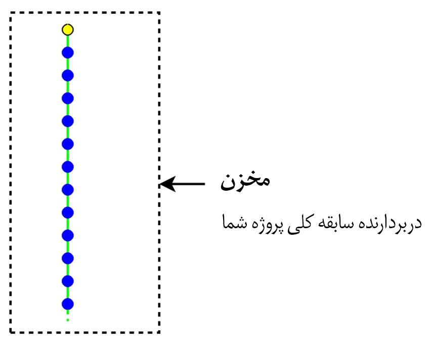
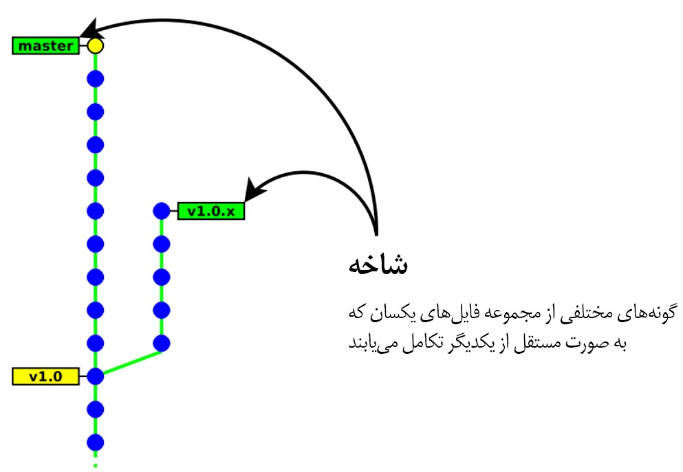
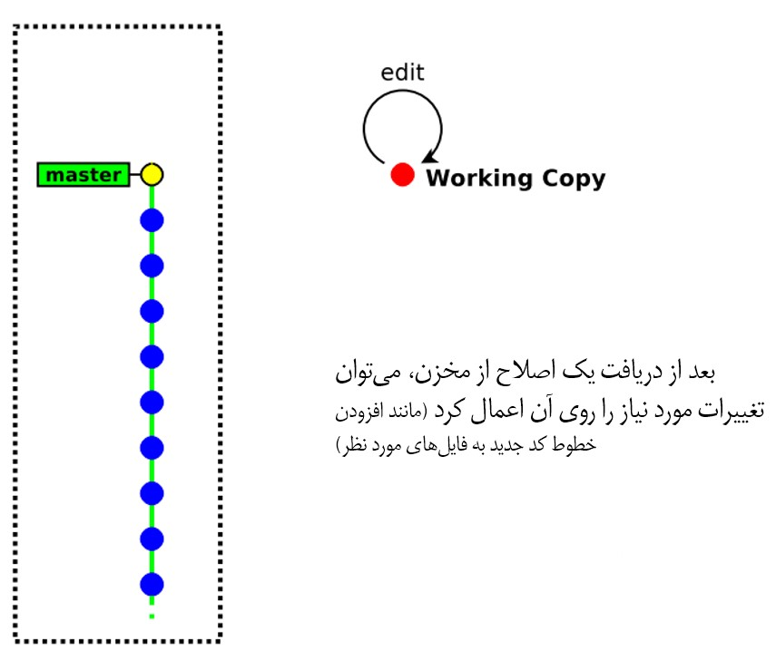
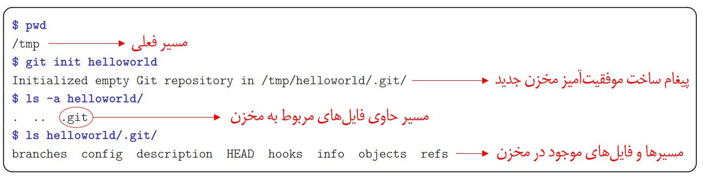
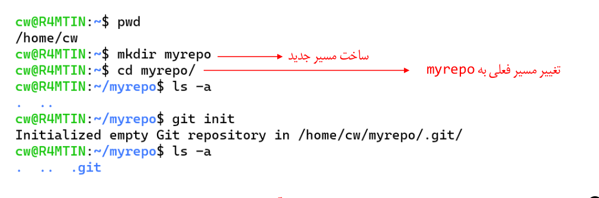

# سامانه های کنترل نسخه (ٰVCS)

version control system یا vcs یکی از مهم ترین سیستم های  مورد استفاده در دنیای برنامه نویسان امروز است. با یک مثال ساده یکی از ویژگی های مهم این سیستم را بررسی میکنیم. فرض کنید یک فایل متنی را ایجاد و چندین بار آن را ویرایش کرده اید. در ویرایش ۵ ام به این نتیجه میرسید که ویرایش اول شما بهتر بوده و قصد بازگشت به نسخه ای را دارید که در ویرایش ۱ ایجاد شده است. سیستم کنترل نسخه این امکان را به شما میدهد که بی نهایت بار اشتباه کنید و بتوانید اشتباهات خود را جبران کنید.  به وسیله ی VCS ها شما میتوانید نسخه های متفاوتی از فایل های خود داشته باشید و در صورت اشتباه آن را تصحیح کنید.

VCS ها تغییرات و ویرایش های مارا ذخیره سازی کرده و به هنگام خطا و در صورت نیاز میتوانند نسخه های قبلی را بازیابی کنند. همچنین VCS ها با فراهم کردن امکانات زیادی مثل قابلیت پیگیری تغییرات اعمالی هر یک از برنامه نویسان، ساخت شاخه هایی مختلف از پروژه، جلوگیری از تداخل کدهای برنامه نویسان و…. فرآیند توسعه پروژه‌ها به صورت گروهی را ساده‌تر می‌سازند. اسا کارکرد تمامی VCS ها بر روی ثبت و ذخیره سازی تاریخچه ی تغییرات فایل هایی است که ما آن ها را تغییر میدهیم. 

**برخی از ویژگی های مهم این سیستم ها عبارتند از : **

1. قابلیت بازگشت به نسخه های مختلف از محتویات فایل ها
2. کاهش ریسک از دست رفتن فایل در اثر اشتباه 
3. مقایسه نسخه های مختلف یک فایل و بررسی تغییرات 
4. پشتیبانی گیری از انواع فایل ها نظیر کدهای یک برنامه کامپیوتری و یا فایل های صوتی و تصویری 

## انواع VCS 


### VCS محلی 


در این نوع از VCS ها نسخه های مختلف و تغییران آن ها از یک فایل در یک پایگاه داده محلی ذخیره سازی میشود. این پایگاه داده در اختیار همگان قرار ندارد بنابراین افراد بیرون از ناحیه ی محلی توانایی استفاده از نسخه های این نوع از VCS را ندارند. RCS(Revision control system) یکی از نمونه های VCS های محلی است . RCS تغییرات را در قابل وصله ها نگه داری میکند.

**نقاط ضعف این سیستم ها عبارتند از :**

1. عدم امکان مدیریت پروژه های گروهی 
2. نقطه تکی شکست (‫‪Single‬‬ ‫‪point‬‬ ‫‪of‬‬ ‫‪failure‬‬) 


### VCS متمرکز 


در این نوع VCS‌ها تمام داده‌ها بر روی یک سرور مرکزی ذخیره می‌شوند و شیوه دسترسی به اطلاعات به صورت Client / Server می‌باشد. یعنی اگر برنامه نویسان بخواهند تغییراتی در پروژه ایجاد کنند باید به سرور مرکزی متصل باشند، در غیر اینصورت نمی‌توانند به اطلاعات پروژه دست پیدا کنند.

**ویژگی های این نوع VCS : **

1. دسترسی چندین کاربر به یک منبع 
2. امکان مدیریت متمرکز بر روی مجوز های دسترسی 

**مثال هایی این نوع VCS : **

1. CVS 
2. Perforce 
3. Subversion 


### VCS توزیع شده 


در این نوع از سیستم های VCS اطلاعات و فایل های پروژه و تغییرات آن در احتیار تمامی برنامه نویسان قرار میگیرد و هر وقت بخواهند میتوانند تغییرات مورد نظر خود را ایجاد کنند و در زمان مدنظرشان آن را با سرور اصلی همگان سازی کنند.سپس هر کدام از اعضای گروه میتواند تغییرات توسط دیگری را از سرور اصلی دریافت کند .یکی از بزرگترین مزیت های این روش آن است که در صورتی که سرور اصلی در دسترس نباشد اعضای گروه میتوانند تغییرات را در سیستم خودشان اعمال کرده و در زمانی که ارتباط دوباره برقرار شد آن را با سرور اصلی هنگام سازی کنند. یکی از مهمترین و پرکاربردترین سیستم های VCS توزیع شده GIT می باشد.

**نمونه های دیگر این نوع سیستم ها : **

1. GIT 
2. Bazaar 
3. Mercurial
4. Darcs 


در تصویر زیر میتوان تاریخچه ی ظهور VCS های توزیع شده را مشاهده کرد.


در ادامه به بررسی پرکاربردترین VCS یعنی GIT میپردازیم. 


# GIT 

همانطور که گفته شد GIT یک سیستم کنترل نسخه است که به صورت توزیع شده سازماندهی شده است. گیت یکی از ابزار های مهم در زندگی برنامه نویسان است و هر برنامه نویسی باید آشنایی کاملی با این ابزار مهم داشته باشد.

در زیر شمای کلی ای از تاریخچه ی گیت را مشاهده میکنید:‌


گیت برای هماهنگ کردن وظایف میان اشخاص مختلفی که، روی یک پروژه کار می‌کنند، مفید است. می‌توانید از گیت برای نوشتن یک مقاله استفاده کنید، یا وقتی که می‌خواهید تغییراتِ اعمال شده را، در یک فایل هنری یا طراحی، پیگیری کنید.

گیت تنها سیستم کنترل ورژن موجود نیست، اما معروف‌ترین آنهاست. بسیاری از برنامه‌نویسان به صورت روزانه از گیت استفاده می‌کنند و بلد بودن آن می‌تواند تأثیر خوبی روی رزومه‌ی کاری‌تان داشته باشد.

توسعهٔ گیت زمانی آغاز شد که بسیاری از توسعه‌دهندگان لینوکس، در استفاده از بیت کیپر، که یک سیستم مدیریت کد می‌باشد که قبلاً برای توسعه هستهٔ لینوکس استفاده می‌شد، امتناع ورزیدند. 

**اهداف مهم توسعه گیت عبارتند از :  **

1. سرعت 
2. طراحی ساده 
3. پشتیبانی از توسعه غیر خطی : یعنی چندین شاخه از یک پروژه را بتوان به صورت موازی پیش برد 
4. توزیع شدگی کامل 
5. توانایی مدیریت پروژه های بزرگ (‌مثل کرنل سیستم عامل لینوکس )

## نگه داری داده ها در گیت 

در برخی از VCS ها از جمله گیت اطلاعات به شکل دنباله ای از صرفا تغییرات نگهداری میشود. یعنی هر نسخه/اصلاح تنها شامل تغییرات به وجود آمده نسبت به نسخه/اصلاح قبلی است. در شکل زیر بهتر این مفهوم مشاهده میشود. 


همانطور که در شکل بالا مشخص است در ابتدا ورژن ۱ فقط شامل فایل های اصلی است و پس از آن فقط تغییرات روی فایل ها ذخیره میشود.در گیت اطلاعات به شکل جریانی از لحظه نگارها (Snapshot) نگهداری میشود.در واقع Snapeshot ها حاصل اعمال تغییرات در آن ورژن بر روی نسخه ی ابتدایی فایل هاست.


برای مثال فرض کنید در ورژن ۲ فایل مربوط به A تغییر کرده است. Snapshot مربوط به این فایل در این مرحله حاصل اعمال تغییرات در این ورژن بر روی فایلی است که در ابتدا و در ورژن ۱ وجود داشته است.

## نصب گیت 

### نصب سیستم عامل ویندوز 

برای نصب گیت در سیستم عامل ویندوز باید در از طریق سایت رسمی [گیت](https://git-scm.com/download/win) نسخه مربوط به سیستم عامل خود را دانلود و به شکل زیر آن را نصب کنید. 

 


پس از اتمام مراحل نصب به شکل بالا Git Bash نیز در ویندوز به صورت خودکار نصب شده است. با استفاده از Git bash میتوان دستورات مهم لینوکسی را در محیط سیستم عامل ویندوز اجرا کرد .(تصویر زیر)


### نصب سیستم عامل لینوکس 

در سیستم عامل لینوکس و در نسخه ی ubuntu با استفاده از دستور زیر میتوان گیت را نصب کرد :‌

```bash
sudo apt-get update 
sudo apt-get install git 
```

در نسخه های redhat نیز به شکل زیر میتوان گیت را نصب کرد. 

```bash
sudo yum install git 
```

## اصطلاحات مهم 

### مخزن یا Repository 

مخزن در بردارنده ی سابقه ی کلی پروژه ی شماست. تمام تغییرات شما در یک پروژه بر روی فایل ها  در یک مخزن قابل مشاهده است.



**دو نوع مخزن داریم :‌**

1. «eocal : این نوع مخزن روی ماشین و کامپیوتر شما ذخیره میشود و میتوان به صورت مستقیم به آن دسترسی داشت. 
2. Remote : این نوع از مخزن ها در واقع یک سرور هستند که افراد مختلف میتوانند به آن متصل شده و تغییرات را دریافت کنند . 

### اصلاح یا Revision 

در گیت تغییرات نسبت به نسخه های قبلی ذخیره میشود و هر تغییر تحت عنوان یک revision ذخیره میشود. revision ها یک نویسنده ی مشخص دارند و علاوه بر این حاوی پیامی است که توضیحات مربوط به تغییرات این نسخه است که توسط نویسنده بیان شده است.


### برچسب یا Tag 

پس از چندین اصلاح ممکن است به یک اصلاح خاص برسیم ( مثلا ممکن است پس از چندین اصلاح یک ورژن از نرم افزار تولید شود که بخواهیم آن را مشخص کنیم  ) پس از رسیدن به این نسخه در طی فرآیند توسعه میتوان این نسخه ی خاص را به وسیله یک برچست مشخص کرد.


### شاخه یا branch 

سناریوی زیر را در نظر بگیرید. فرض کنید شما و دوست برنامه نویستان قصد دارید روی یک پروژه کار کنید و قسمت های مختلف را بین خود و او تقسیم میکند. برای این که شما دو نفر به صورت موازی بتوانید وظایف خود را پیش ببرید هر کدام یک شاخه ایجاد کرده و تغییرات را روی شاخه ی مربوط به خودتان انجام میدهید. استفاده از شاخه در گیت خصوصا در پروژه هایی که به صورت گروهی انجام میگیرد بسیار ضروریست . 



برای درک بهتر در تصویر بالا فرض کنید شاخه ی سمت چپ را شما و شاخه ی سمت راست را دوستتان توسعه داده است.

### ایجاد تغییر در پروژه و اعمال آن 


فرض کنید یک پروژه را که دارای گیت است در اختیار شما قرار داده اند و وظایفی به شما در مورد پروژه محول شده است. برای ایجاد تغییر ابتدا باید یک از کپی از پروژه را دریافت کرده و سپس تغییرات را اعمال کنید .

پیش از آن که روند ایجاد تغییر در فایل ها را بررسی کنیم ابتدا با چند مفهوم برای این امر آشنا میشویم . 

فایل هایی که در یک پروژه وجود دارند از نظر گیت به سه دسته تقسیم میشوند: 

1. فایل های working area یا فایل هایی که در پوشه ی پروژه موجود هستند ولی گیت آن ها را دنبال نمیکند. 
2. فایل های Staging area یا فایل هایی که گیت آن ها را دنبال میکند.
3. فایل های commited area یا فایل هایی که گیت تغییرات آن را دنبال و همچنین تغییرات آن را ذخیره میکند.

 


همانطور که میبینید فایل های موجود در پروژه ی شما توسط گیت به سه دسته تقسیم شده اند. 

حال برای ایجاد تغییرات در یک پروژه ی تحت گیت باید آن را در یک working directory ایجاد کنیم و سپس فایل هایی که میخواهیم گیت تغییرات آن ها را  نظاره کند به staging area اضافه و اگر میخواهیم تغییری را ذخیره کنیم تغییرات فایل را در Commited area ذخیره میکنیم. 

 

در تصویر بالا فرض کنید که یک پروژه ی تحت گیت داریم که شاخه ی اصلی آن به شکل بالا نمایش داده شده است و میخواهیم تغییرات خود را اعمال و آن را ذخیره  کنیم. 

ابتدا یک working copy ایجاد میکنم تا بتوانیم با پروژه کار کنیم.


سپس عمل checkout را انجام میدهیم تا آخرین نسخه ی نرم افزار را داشته باشیم.سپس تغییرات خود را در پروژه اعمال میکنیم .





پس از اعمال تغییرات آن ها را به عنوان یک commite به پروژه اضافه میکنم ( به بیان دیگر فایل های تغییر داده شده به commited area اضافه میشوند)

بنابراین فایل های پروژه ۴ حالت میتوانند داشته باشند:

- Untracked : توسط گیت رصد نمیشوند(داخل working area)
- Unmodified : از لحظه نگار قبلی تاکنون تغییره نکرده است.
- Modified : تغییر کرده است ولی هنوز در پایگاه داده ثبت نشده است.
- Staged : تغییر کرده است و آماده ی ثبت برای یک لحظه نگاه یا SnapShot است.


## بخش عملی 

### ساخت مخزن 

پس از این که مفهوم مخزن را متوجه شدیم لازم است بتوانیم یک مخزن را ایجاد و سپس با آن پروژه ی خود را مدیریت کنیم.

با استفاده از دستور یک یک مخزن در پوشه ی myrepository میتوان ساخت. 

```bash
git init myrepository
```

این دستور یک پوشه به نام myrepository میسازد و مخزن اصلی در مسیر myrepositor/.git ذخیره میشود. فایل های پروژه نیز در مسیر myrepository قرار میگیرد(چون فایلی ایجاد نکردیم بنابراین در ابتدا فایلی برای پروژه در این پوشه موجود نیست)



در صورتی که ورودی دستور بالا خالی باشد مخزن در پوشه ی فعلی که قرار داریم ذخیره میشود.



**توجه کنید که پوشه ی .git حاوی کلیه ی اطلاعات مهم پروژه توسط گیت است و نباید هیچ وقت آن را حذف کنید . در صورت حذف آن کلیه ی سوابق پروژه و تغییرات آن حذف میشود**

### ثبت مشخصات کاربر 

پس از آن که گیت را نصب کردید  و پیش از هر کاری باید اطلاعات خود را که شامل یک ایمیل و یک نام کاربری است به گیت بدهید تا آن را ثبت کند. 

```bash
git config --gobal user.email "youremail"
git config --global user.name "yourusername"
```

### ایجاد و ثبت تغییرات 

پس از مقداردهی اولیه مخزن (repository) در پوشه ی مربوط به پروژه تغییرات خود را اعمال کنید (برای مثال در تصویر زیر فایل hello را ایجاد کردیم ) . سپس با دستور git add فایل هایی که ایجاد کرده ایم را به Staging area اضافه کرده و آن ها را آماده ی کامیت شدن میکنیم.

```bash
git add file [file1] [file2] ... 
git commite -m [YourCommiteMessage]
```


میتوان به جای آن که فایل ها را به صورت جداگانه Add کنیم با استفاده از دستور زیر و استفاده از . تمامی فایل ها را add کنیم.

```bash
git add . 
```

**برای هر کامیت باید یک پیام وارد شود. این پیام شامل یک توضیح در مورد تغییری است که شما در فایل ها ایجاد کرده اید که به اجبار باید وارد شود.**


### مشاهده گزارش تغییرات

با استفاده از دستوری که در پایین مشاهده میکنید میتوان تغییرات گزارش کامیتی که زده ایم را مشاهده کنیم.

```bash
git log 
```


### دریافت وضعیت 

با استفاده از دستور زیر میتوان اطلاعات زیادی را در مورد مخزن دریافت کرد که در ادامه بیان میشود.

```bash
git status  
```

- شاخه کنونی 
- وضعیت تازگی اطلاعات نسب به سرور 
- فایل های تغییر یافته (modified)  ولی نشان نشده (‌unstaged)
- فایل های تغییر یافته و آماده ی ثبت

پس از اجرای دستور بالا خروجی زیر ظاهر میشود.


طبیعی است که چیزی برای کامیت شدن موجود نباشد زیر فایلی که تغییر دادیم در قسمت قبل commite شده است و اکنون هیچ تغییری نشان داده نمیشود.

**حال یک فایل جدید ایجاد میکنیم تا وضعیت را مجددا بسنجیم**


فایل Universe را ایجاد و git status را مجددا اجرا کردیم.همانطور که مشاهده میشود فایل تازه ایجاد شده ی Universe توسط گیت Track نمیشود برای آن که این فایل را به مجموعه ی Staged Area اضافه کنیم ( تا آماده ثبت شود) از Git add استفاده و سپس وضعیت را دوباره میسنجیم.


همانطور که در تصویر مشاهده میشود پس از add شدن وضعیت فایل Universe تغییر کرد و تغییرات این فایل توسط گیت دنبال میشود.

حال محتویات hello را که قبلا ساخته شده است تغییر میدهیم و وضعیت را دوباره بررسی میکنیم.


همانطور که مشاهده میشود فایل hello آماده ی ثبت نیست. 

برای ثبت فایل های تغییر یافته در هنگام کامیت میتوان از سوییچ -a استفاده کرد. 


در صورتی که از این سوییچ استفاده نکنیم تغییراتی که در متن hello داشتیم ثبت نمیشدند.


یک راه دیگر آن بود که پس از تغییر فایل hello مجددا آن را به staging area اضافه کنیم.

```bash
git add hello
```

### ساخت branch و استفاده از آن

مفهوم شاخه (branch) را پیش از این توضیح دادیم و در این قسمت به صورت عملی یادمیگیریم که چگونه یک شاخه را از پروژه ی خود ایجاد و روی آن کار کنیم.


هنگامی که با استفاده از دستور git init یک مخزن ایجاد میکنیم به صورت پیشفرض یک شاخه ی master ساخته میشود که نقش اصلی مخزن مذکور را بازی میکند و هر کامیتی که انجام دهیم روی این branch انجام میشود. در توسعه ی نرم افزار شاخه master شاخه اصلی توسعه است و فقط باید کدهایی روی آن قرار گیرد که کاملا پایدار و بدون مشکل هستند. با این تفاسیر منطقی به نظر میرسد که شاخه master به عنوان شاخه ی آزمون و خطا استفاده نشود و هنگامی که یکی از اعضای تیم قصد توسعه ی نرم افزار را داشت شاخه ی جدایی را ایجاد کرده و روی آن ادامه دهد تا هنگامی که به پایداری اشاره شده برسد.

یکی از مزایای وجود شاخه‌ها در سیستم کنترل نسخهٔ گیت آن است که می‌توان به تعداد توسعه‌دهندگانی که در تیم حضور دارند برنچ‌های اختصاصی ساخته و در آن واحد تمامی اعضای تیم بتوانند اقدام به توسعهٔ نرم‌افزار کنند.

همان‌طور که در تصویر فوق ملاحظه می‌شود، خط عمودی که در سراسر نمودار مشاهده می‌شود به عنوان شاخه اصلی یا master است که فرض می‌کنیم توسط توسعه‌دهندهٔ اصلی پروژه کامیت‌هایی تحت عناوین C1 و C2 انجام شده است. سپس یک شاخه از شاخهٔ اصلی جدا شده و نامی دلخواه همچون Branch1 برای آن در نظر گرفته‌ایم که فرضاً توسط یکی از اعضای تیم توسعه داده میشود به طوری که وی سه کامیت داخل این شاخه انجام داده است. در آنِ واحد،‌ برای یکی دیگر از اعضای تیم شاخه‌ای به نام Branch2 ساخته شده و او نیز یک کامیت انجام داده است. در نهایت، دولوپر اصلی این پروژه کلیهٔ تغییرات اِعمال‌شده در دو شاخه فوق را با شاخه اصلی (master) ادغام کرده و کلیهٔ‌ این تغییرات را تحت عنوان C7 کامیت کرده است.

حال که با مفهوم branch به صورتی بهتر آشنا شدیم بهتر است چند دستور آن را نیز بررسی کنیم .

برای آن لیستی از branch های پروژه را مشاهده کنیم دستور زیر را اجرا میکنیم:‌

```bash
git branch
* master
```

دستور git branch لیستی از کلیه ی شاخه ها را نمایش میدهد و همانطور که گفتیم شاخه ی master به صورت پیش فرض نمایش داده شده است. علامت * تایید میکند که الان روی این شاخه هستیم.

فرض کنید که میخواهیم شاخه ی دیگری از شاخه ی اصلی ایجاد کنیم تا وظایف خود را روی آن شاخه ادامه دهیم. به شکل زیر عمل کرده و شاخه ی branch1 را ایجاد میکنیم. 

```bash
git branch branch1
```

پس از ایجاد شاخه ی مورد نظر یک بار دیگر لیست شاخه ها را نمایش میدهیم.

```bash
 git branch
* master
  branch1
```

همانطور که مشاهده میشود شاخه ی branch1 ساخته شد و در لیست شاخه ها نمایان میشود. توجه کنید که با دستور مورد نظر شاخه ی جدید ساخته میشود ولی ما کماکان روی شاخه ی master قرار داریم. برای تغییر شاخه از دستور زیر استفاده میکنیم‌:

```bash
git checkout branch1 
Switched to branch 'branch1'

```

سپس لیست شاخه ها را دوباره نمایش میدهیم‌: 

```bash
git branch 
  master
* branch1
```

بدین ترتیب با توجه به این که علامت ستاره روی branch1 قرار  دارد پس ما الان روی شاخه ی branch1 هستیم .

از این پس هر کامیتی که انجام دهیم روی همین شاخه اعمال میشود.برای این کار یک فایل متنی ایجاد میکنیم و سپس آن را کامیت میکنیم تا ببینیم تغییرات در کدام شاخه اعمال میشود.

```bash
git add new.txt
git commit -m "new file added"
[branch1 b276cac] new file added
 1 file changed, 3 insertions(+)
 create mode 100644 new.txt
```

سپس گزارش تغییرات شاخه را با دستور git log چک میکنیم.

```bash
 git log --oneline
b276cac (HEAD -> branch1) new.txt
23d2256 (master) a new line added
fd728ca Yet another commit
```

همانطور که میبینیم در پیامی که برای کامیت آمده است مشاهده میشود که تغییرات روی branch1 اعمال شده است و نه  master . 

حال مجددا به شاخه ی master رجوع میکنیم تا ببینیم آیا فایل مورد نظر در این شاخه نیز وجود دارد یا خیر : 

```bash
git checkout master 
Switched to branch 'master'
```

اکنون اگر به محتویات داخل پوشه نگاهی بیندازیم،‌ خواهیم دید که فایل new.txt حذف شده است و این مسئله از آنجا ناشی می‌گردد که ما این فایل را در شاخه branch1 افزوده‌ایم و شاخه master هیچ اطلاعی از این موضوع ندارد.

**حذف کردن یک شاخه **

با استفاده از سوییچ -d میتوان یک شاخه را حذف کرد. در مثال قبل سعی میکنیم که شاخه ای که ایجاد کرده ایم را حذف کنیم:

```bash
git branch -d branch1
error: The branch 'branch1' is not fully merged.
If you are sure you want to delete it, run 'git branch -D branch1'.
```

همانطور که مشاهده میکنید شاخه ی branch1 حذف نشد و  گیت هشدار میدهد که تغیراتی که در آن شاخه اعمال شده است هنوز با شاخه ی master ادغام یا merge نشده است.

**توجه:‌ اگر از آپشن D (به صورت حروف بزرگ) در دستور استفاده کنیم بدون توجه به ادغام این دو شاخه آن را حذف میکند.**

پس از حذف اگر نگاهی دوباره به شاخه ها بیندازیم میبینیم که شاخه ی branch1 حذف شده است :‌

```
git branch
* master
```

حال حالت دیگری را بررسی میکنیم . فرض کنید در قسمت قبل به جای آن که بخواهیم شاخه را حذف کنیم بخواهیم آن را پیش از حذف شدن با شاخه ی master ادغام کنیم. برای این کار هنگامی که روی شاخه ی اصلی قرار داریم از دستور git merge استفاده میکنیم . این دستور شاخه ی branch1 را با شاخه ی اصلی (master) ادغام میکند و خود به خود شاخه ی branch1 را حذف میکند.

**جمع بندی**

مفهوم شاخه‌ها در گیت را به نوعی می‌توان به عنوان یکی از کلیدی‌ترین خصیصه‌های این سیستم کنترل نسخه تلقی کرد چرا که اساساً این امکان در اختیار تیم‌های مهندسی قرار می‌گیرد تا بتوانند به هر تعداد که بخواهند شاخهٔ جدید ایجاد کرده و افراد متعددی در آنِ واحد روی پروژه کار کنند.

### گیتهاب 

پیش از این اشاره کردیم که مخزن ها در گیت شامل تمامی موارد پروژه هستند . مخازن گیت دو نوع هستند : 

1. مخزن محلی : که روی ماشین شما نصب میشود 
2. مخزن Remote : که به صورت ریموت و روی یک سرور خارج از ماشین شما ایجاد میشود.

[گیتهاب](https://github.com/) (Github) یک مخزن تحت وب است که به شما اجازه میدهد تا پروژه های خود را به صورت ریموت در اختیار دیگران قرار دهید. در ادامه ی این موضوع فرض کنید که دو نفر بر روی یک پروژه ی مشترک کار میکنند که یکی در یک شهر و دیگری در شهری دیگر زندگی میکند. گیتهاب این امکان را فراهم میکند که مخازن خود را با یکدیگر اشتراک بگذارند.

برای این که یک مخزن ریموت در گیتهاب درست کنید باید ابتدا در این وبسایت ثبت نام کنید و سپس با استفاده دکمه ی سمت راست و کنار تصویر پروفایل new repository را کلیک کنید. 


	

پس از کلیک بر روی این دکمه صفحه ی زیر باز میشود که اطلاعات مربوط به مخزن یعنی نام پروژه و دیگر ویژگی ها از جمله عمومی و یا خصوصی بودن آن را باید مشخص کنید و سپس مخزن را ایجاد کنید.


پس از ایجاد مخزن برای این که فایل های خود را روی مخزن قرار دهیم تا دیگران بتوانند به آن دسترسی داشته باشند باید ابتدا آدرس مخزن ریمورت خود را به مخزن محلی خود اضافه کنیم تا مخزن محلی به مخزن ریموت متصل شود. برای این کار از دستور زیر استفاده میکنیم . 

```bash
git remote add origin git@github.com:ROF13ThFloor/TestRepo.git
```

پس از اضافه شدن مخزن ریموت گیتهاب باید کدهای کامیت شده ی خود را به گیتهاب اضافه کنیم. برای این کار از دستور push استفاده میکنم .

```bash
git push -u origin main
```

### fetch & pull 


<p align="center">
  
</p>
